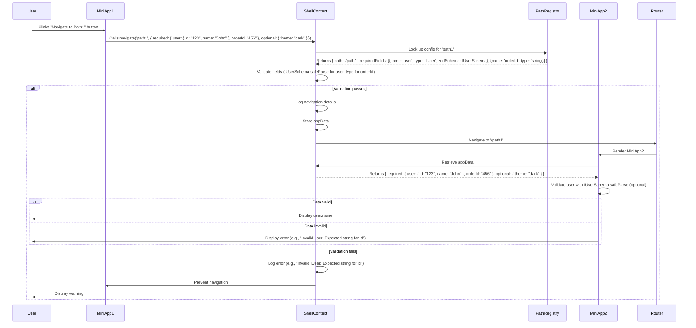

Thank you for specifying that you want to use the `zod` library for validating complex types like `IUser` in your TypeScript-based React microfrontend application. Using `zod` simplifies runtime validation of `appData` attributes (e.g., `user: IUser`) without manually checking properties, aligns with your requirement to avoid property-by-property checks, and provides robust error messages for debugging. Below, I’ll provide a **User Story** that incorporates `zod` for validating complex types in the `pathRegistry` and `navigate` function, ensuring compatibility with your microfrontend architecture and facilitating efficient refactoring of your existing `webPath` object. I’ll also include an updated **Mermaid sequence diagram** to reflect the `zod`-based validation and provide code examples for implementation.

---

### Solution Overview
The solution will:
1. Use `zod` to define schemas for complex types like `IUser` and validate `appData` in the `navigate` function.
2. Update the `pathRegistry` to include `zod` schemas instead of custom type predicates.
3. Modify `ShellContext` to validate `appData` using `zod` schemas, providing detailed error messages.
4. Provide a script to refactor `webPath` into `pathRegistry` with `zod` schemas.
5. Ensure compatibility with microfrontends using Module Federation for sharing types and schemas.
6. Update the user story and sequence diagram to reflect `zod` integration.

---

### 1. Define Types and Zod Schemas
We’ll create a shared `types` module with `zod` schemas for `IUser` and other types, integrated into `pathRegistry`.

```typescript
// shared-types/index.ts
import { z } from 'zod';

// Define IUser schema with zod
export const IUserSchema = z.object({
  id: z.string(),
  name: z.string(),
  email: z.string().optional(),
});

export type IUser = z.infer<typeof IUserSchema>;

export type PrimitiveType = 'string' | 'number' | 'boolean';
export type ComplexType = 'IUser'; // Add other complex types as needed

export interface FieldConfig {
  name: string;
  type: PrimitiveType | ComplexType;
  zodSchema?: z.ZodSchema; // Zod schema for validation
}

export interface AppData {
  required: Record<string, string | number | boolean | IUser>;
  optional?: Record<string, any>;
}

export interface PathConfig {
  path: string;
  requiredFields: FieldConfig[];
  optionalFields?: FieldConfig[];
}

export const pathRegistry: Record<string, PathConfig> = {
  path1: {
    path: '/path1',
    requiredFields: [
      { name: 'user', type: 'IUser', zodSchema: IUserSchema },
      { name: 'orderId', type: 'string' },
    ],
    optionalFields: [{ name: 'theme', type: 'string' }],
  },
  path2: {
    path: '/path2',
    requiredFields: [{ name: 'userId', type: 'string' }],
    optionalFields: [{ name: 'categoryId', type: 'number' }],
  },
};
```

**Key Points**:
- `IUserSchema` defines the structure of `IUser` using `zod`, with `id` and `name` as required strings and `email` as an optional string.
- `FieldConfig` includes a `zodSchema` field for complex types like `IUser`.
- `pathRegistry` associates `user` with `IUserSchema` for `path1`.
- The `zod` library provides robust validation and detailed error messages.

---

### 2. Update `ShellContext` with Zod Validation
The `navigate` function uses `zod` schemas to validate `appData`, replacing the previous type predicate approach.

```typescript
// shell/src/ShellContext.tsx
import { createContext, useContext, useState } from 'react';
import { useNavigate } from 'react-router-dom';
import { pathRegistry, AppData, FieldConfig, PrimitiveType } from 'shared-types';
import { z } from 'zod';

interface ShellContextType {
  appData: Record<string, AppData>;
  navigate: (pathKey: string, data: AppData) => void;
}

const ShellContext = createContext<ShellContextType | undefined>(undefined);

export const ShellProvider: React.FC = ({ children }) => {
  const [appData, setAppData] = useState<Record<string, AppData>>({});
  const navigate = useNavigate();

  const validatePrimitiveType = (field: FieldConfig, value: any): boolean => {
    switch (field.type as PrimitiveType) {
      case 'string':
        return typeof value === 'string';
      case 'number':
        return typeof value === 'number';
      case 'boolean':
        return typeof value === 'boolean';
      default:
        return false;
    }
  };

  const customNavigate = (pathKey: string, data: AppData) => {
    const config = pathRegistry[pathKey];
    if (!config) {
      console.error(`Path key "${pathKey}" not found in pathRegistry`);
      return;
    }

    const missingFields = config.requiredFields.filter(
      (field) => !(field.name in data.required)
    );
    const invalidTypes: string[] = [];

    config.requiredFields.forEach((field) => {
      if (!(field.name in data.required)) return;
      const value = data.required[field.name];
      if (field.zodSchema) {
        const result = field.zodSchema.safeParse(value);
        if (!result.success) {
          invalidTypes.push(
            `${field.name} (expected ${field.type}): ${result.error.issues
              .map((issue) => issue.message)
              .join(', ')}`
          );
        }
      } else if (!validatePrimitiveType(field, value)) {
        invalidTypes.push(`${field.name} (expected ${field.type})`);
      }
    });

    if (missingFields.length > 0) {
      console.error(
        `Navigation to ${config.path} failed: Missing required fields: ${missingFields
          .map((f) => f.name)
          .join(', ')}`
      );
      return;
    }

    if (invalidTypes.length > 0) {
      console.error(`Navigation to ${config.path} failed: Invalid types: ${invalidTypes.join(', ')}`);
      return;
    }

    console.log(`Navigating to ${config.path} with data:`, JSON.stringify(data, null, 2));
    setAppData((prev) => ({ ...prev, [config.path]: data }));
    navigate(config.path);
  };

  return (
    <ShellContext.Provider value={{ appData, navigate: customNavigate }}>
      {children}
    </ShellContext.Provider>
  );
};

export const useShell = () => {
  const context = useContext(ShellContext);
  if (!context) throw new Error('useShell must be used within ShellProvider');
  return context;
};
```

**Key Points**:
- `zodSchema.safeParse` validates complex types like `IUser`, providing detailed error messages (e.g., “Expected string, received number for id”).
- Primitive types are validated using `validatePrimitiveType`.
- Errors are logged with `zod`’s detailed issue messages for better debugging.
- TypeScript infers `IUser` from `IUserSchema` for type safety.

---

### 3. Miniapp Example with Zod
Miniapps use `zod` schemas for type safety and validation.

```typescript
// mini-app1/src/App.tsx
import { useShell } from 'shell/ShellContext';
import { IUser, IUserSchema } from 'shared-types';

const App = () => {
  const { navigate } = useShell();

  const handleNavigate = () => {
    const user: IUser = { id: '123', name: 'John Doe', email: 'john@example.com' };
    navigate('path1', {
      required: { user, orderId: '456' },
      optional: { theme: 'dark' },
    });
  };

  return <button onClick={handleNavigate}>Go to Path1</button>;
};

export default App;

// mini-app2/src/App.tsx
import { useLocation } from 'react-router-dom';
import { useShell } from 'shell/ShellContext';
import { IUser, IUserSchema } from 'shared-types';

const App = () => {
  const { appData } = useShell();
  const { pathname } = useLocation();
  const data = appData[pathname] || { required: {} };

  const user = data.required.user;
  const result = IUserSchema.safeParse(user);
  if (!result.success) {
    return <div>Error: Invalid user data - {result.error.issues.map((issue) => issue.message).join(', ')}</div>;
  }

  return (
    <div>
      User: {result.data.name} (ID: {result.data.id})
    </div>
  );
};

export default App;
```

**Key Points**:
- `MiniApp1` passes a typed `IUser` object, enforced by TypeScript.
- `MiniApp2` uses `IUserSchema.safeParse` to validate `user` at runtime, displaying detailed errors if invalid.

---

### 4. Refactoring `webPath`
The script converts `webPath` into `pathRegistry` with `IUserSchema` as a default for `user`.

```typescript
// generatePathRegistry.ts
import { PathConfig, FieldConfig, IUserSchema } from 'shared-types';

const webPath = {
  path1: '/path1',
  path2: '/path2',
  // ... other paths
};

const defaultRequiredFields: FieldConfig[] = [
  { name: 'user', type: 'IUser', zodSchema: IUserSchema },
];

const pathRegistry = Object.keys(webPath).reduce(
  (acc, key) => ({
    ...acc,
    [key]: {
      path: webPath[key],
      requiredFields: defaultRequiredFields,
      optionalFields: [],
    },
  }),
  {} as Record<string, PathConfig>
);

console.log(JSON.stringify(pathRegistry, null, 2));
```

**Steps**:
1. Install `zod` in your project: `yarn add zod`.
2. Run the script to generate `pathRegistry` with `user: IUser` as a default.
3. Manually add other fields (e.g., `orderId: string`) for each path.
4. Update navigation calls to use `pathKey` and `IUser` (e.g., `navigate('path1', { required: { user: { id, name } } })`).
5. Use `zod` error logs to identify paths needing adjustments.

---

### 5. Microfrontend Integration
To share `zod` schemas and types across microfrontends, use Module Federation:

```javascript
// shell/webpack.config.js
const ModuleFederationPlugin = require('webpack/lib/container/ModuleFederationPlugin');

module.exports = {
  plugins: [
    new ModuleFederationPlugin({
      name: 'shell',
      remotes: {
        miniApp1: 'miniApp1@http://localhost:3001/remoteEntry.js',
        miniApp2: 'miniApp2@http://localhost:3002/remoteEntry.js',
      },
      shared: {
        react: { singleton: true },
        'react-dom': { singleton: true },
        'react-router-dom': { singleton: true },
        zod: { singleton: true },
        'shared-types': { singleton: true, eager: true },
      },
    }),
  ],
};
```

**Note**: Ensure `zod` is shared to avoid duplicate instances across microfrontends.

---

### 6. Updated User Story with Zod


# User Story: Standardize Navigation with Zod-Based Complex Type Validation in Microfrontend Application

## Title
As a developer, I want to standardize navigation and data passing with complex type validation using the `zod` library in the microfrontend application so that I can ensure destination pages receive correctly typed data (e.g., `IUser`) without manually checking object properties, reducing errors and improving maintainability.

## Description
In our React microfrontend application, we have a shell application hosting multiple miniapps. Navigation between pages is defined in a `webPath` object (e.g., `{'path1': '/path1', 'path2': '/path2'}`) and managed by a `navigate` function that passes data via `appData` stored in the shell’s context. Some `appData` attributes, such as `user`, are complex types like `IUser` (e.g., `{ id: string, name: string, email?: string }`). Currently, the lack of clear type requirements and validation for these complex types leads to errors where required data is missing or incorrectly structured, especially since destination pages can be accessed from multiple sources. Validating complex types by checking individual properties is cumbersome and error-prone. We need a solution to define typed `appData` requirements for each path, validate complex types like `IUser` using `zod` schemas without property-by-property checks, and refactor the large number of existing paths efficiently.

## As a
Developer

## I want to
Standardize the navigation process and data passing for each path with validation for complex types like `IUser` using `zod` schemas, without manually checking object properties

## So that
I can ensure destination pages receive correctly typed and required data, reduce runtime errors, improve debugging with detailed error messages, and refactor existing paths efficiently in our microfrontend architecture.

## Acceptance Criteria

1. **Path Registry with Zod Schema Support**:
   - A centralized `pathRegistry` maps each path key (e.g., `path1`, `path2`) to its actual path (e.g., `/path1`, `/path2`) and required/optional `appData` fields with their specific data types, including primitive types (`string`, `number`, `boolean`) and complex types like `IUser`.
   - Example: For `path1`, required fields might be `user: IUser` (validated by a `zod` schema) and `orderId: string`.
   - The `pathRegistry` is defined using TypeScript interfaces and `zod` schemas to enforce type safety.
   - The registry supports dynamic updates for adding or modifying paths without changing core navigation logic.
   - Complex types like `IUser` are validated using `zod` schemas (e.g., `IUserSchema`) without checking individual properties.

2. **Navigation Function with Zod Validation**:
   - The `navigate` function in the shell’s context accepts a `pathKey` (e.g., `path1`) and an `appData` object containing `required` and `optional` fields.
   - It validates that all required fields are present and match their specified types, using `zod` schemas (e.g., `IUserSchema.safeParse`) for complex types like `IUser` to avoid property-by-property checks.
   - Validation failures (missing fields or incorrect types) log detailed errors from `zod` (e.g., “Expected string, received number for id”) and prevent navigation.
   - The `appData` is stored in the context under the destination path’s key for retrieval by the destination page.
   - TypeScript infers types from `zod` schemas (e.g., `z.infer<typeof IUserSchema>`) for safe usage in destination pages.

3. **Data Access in Destination Pages**:
   - Destination pages retrieve `appData` from the shell’s context using the current `pathname` (from `react-router-dom`).
   - If required data is missing or invalid (e.g., fails `IUserSchema.safeParse`), the page displays a user-friendly error message with `zod` error details (e.g., “Invalid user data: Expected string for id”).
   - Pages are wrapped in an `ErrorBoundary` to prevent crashes and display user-friendly error messages with recovery instructions.

4. **Refactoring Existing Paths**:
   - A script or process converts the existing `webPath` object into the `pathRegistry` format, including default `zod` schemas for complex types like `IUser`.
   - Minimizes changes to existing navigation calls (e.g., from `navigate('/path1', ...)` to `navigate('path1', { required: { user: IUser, ... } })`).
   - Provides a guideline or automated script to refactor a large number of paths with minimal disruption.
   - Includes a validation step to identify paths with incomplete or missing type definitions during refactoring.

5. **Debugging Support**:
   - The `navigate` function logs detailed information, including path key, destination path, provided `appData`, and validation results with `zod` error messages (e.g., “Invalid IUser: Expected string for id”).
   - Logs include timestamps and the source page (if provided in `appData`) for tracing navigation flows.
   - A debug mode warns about missing optional fields that are commonly used.
   - Errors in destination pages (e.g., invalid `IUser`) are logged with `zod` error details and context.

6. **Type Safety and Developer Experience**:
   - TypeScript enforces type safety for `pathKey` and `appData`, providing autocompletion for field names and types (e.g., `IUser` fields like `id`, `name`) inferred from `zod` schemas.
   - JSDoc comments or documentation detail required/optional fields and their `zod` schemas, including complex types like `IUser`.
   - A utility generates TypeScript types from `pathRegistry` and `zod` schemas for consistency.

7. **Scalability for Microfrontend Architecture**:
   - The `pathRegistry` and `zod` schemas (e.g., `IUserSchema`) are shared across the shell and miniapps via a shared module (e.g., `shared-types` package with Module Federation).
   - Miniapps validate navigation calls using `pathRegistry` and `zod` schemas without direct dependency on the shell’s implementation.
   - Supports nested routes within miniapps with their own typed `appData` requirements.

8. **Handling Edge Cases**:
   - If a `pathKey` is not found in `pathRegistry`, the `navigate` function logs an error and prevents navigation.
   - If a page is accessed directly (e.g., via URL or refresh), it checks for missing or invalid `appData` (using `IUserSchema.safeParse`) and redirects to a fallback page or displays an error.
   - Handles cases where the same destination page is accessed from multiple sources with context-specific typed requirements.

9. **Performance Optimization**:
   - The `navigate` function minimizes context updates by storing only necessary `appData`.
   - The `pathRegistry` and `zod` schemas are loaded efficiently (e.g., as static objects) to avoid performance overhead.
   - Navigation performance is monitored, with logs ensuring validation (including `zod` parsing) takes less than 10ms.

10. **Testing and Validation**:
    - Unit tests verify the `navigate` function for presence and type correctness, including complex types like `IUser` using `zod` schemas.
    - Integration tests ensure navigation passes correctly typed `appData` to destination pages.
    - A test script validates `pathRegistry` for completeness (e.g., all required fields have defined types or schemas).
    - A linter rule warns developers if `navigate` is called with an undefined `pathKey` or incorrect types.

11. **Zod-Based Validation**:
    - The `pathRegistry` defines exact data types (`string`, `number`, `boolean`, or complex types like `IUser` with `zod` schemas) for each required/optional field.
    - The `navigate` function validates `appData` using `zod` schemas (e.g., `IUserSchema.safeParse`) for complex types, avoiding manual property checks.
    - Type errors are logged with detailed `zod` error messages (e.g., “Expected string, received number for id”).
    - Destination pages assume `appData` fields are correctly typed after `zod` validation, reducing runtime checks.

12. **Visualization of Navigation Flow**:
    - A Mermaid sequence diagram visualizes the navigation process, including:
      - User interaction with a source miniapp to initiate navigation.
      - The `navigate` function’s validation of `appData` using `zod` schemas (e.g., `IUserSchema`).
      - Storage of `appData` in the shell’s context.
      - Navigation to the destination page via `react-router-dom`.
      - Retrieval and validation of `appData` in the destination miniapp using `zod`.
      - Error handling for missing or invalid data (e.g., invalid `IUser`).
    - The diagram includes all participants: User, MiniApp1 (source), ShellContext, PathRegistry, MiniApp2 (destination), and Router.
    - It highlights the use of `zod` schemas to simplify complex type validation.

## Notes
- **Zod Integration**: Using `zod` simplifies validation of complex types like `IUser` with robust error messages, eliminating manual property checks and improving debugging.
- **Refactoring Efficiency**: The script for converting `webPath` to `pathRegistry` with `zod` schemas minimizes manual effort for large path sets.
- **Microfrontend Compatibility**: Module Federation and a shared `types` package ensure `zod` schemas and types are consistent across the shell and miniapps.
- **Alignment with Diagram**: The Mermaid sequence diagram accurately reflects the navigation flow with `zod`-based validation.

## Reference: Mermaid Sequence Diagram
The following sequence diagram visualizes the navigation and validation process with `zod`:




---

### Additional Notes
- **Zod Benefits**: `zod` provides robust runtime validation with detailed error messages, simplifying complex type validation and aligning with your requirement to avoid manual property checks. It’s lightweight (~40kB minified) and integrates well with TypeScript.
- **Refactoring Support**: The `generatePathRegistry.ts` script automates the conversion of `webPath` to `pathRegistry` with `IUserSchema`, reducing manual effort for large path sets.
- **Microfrontend Compatibility**: Module Federation ensures `zod` and `shared-types` are shared across the shell and miniapps, maintaining consistency.
- **Debugging**: `zod`’s error messages (e.g., “Expected string, received number for id”) enhance debugging, especially for complex types.

---

### Next Steps
- **Confirm User Story**: Let me know if the user story and acceptance criteria meet your needs or if you need adjustments (e.g., additional `zod` schemas for other complex types).
- **Provide `IUser` Details**: If your `IUser` interface differs (e.g., additional fields or nested objects), share it for a tailored solution.
- **Implementation**: I can provide a complete codebase (shell, miniapps, shared types) or focus on specific parts (e.g., test cases, Module Federation setup).
- **Additional Examples**: I can search for more `zod`-based microfrontend examples or provide further miniapp examples.
- **Diagram Adjustments**: If you prefer a different diagram type (e.g., class diagram), I can generate it.

Please share any additional details (e.g., specific `IUser` fields, other complex types, or preferred project structure) or let me know how you’d like to proceed!