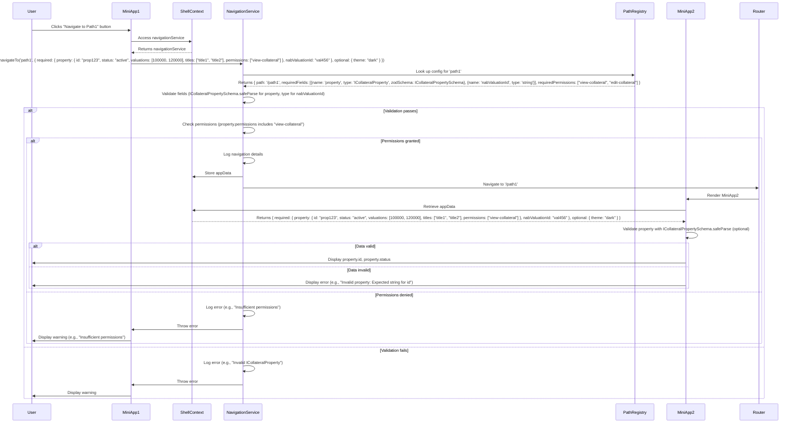

### Assumptions and Clarifications
- **Navigation Service Role**: The `NavigationService` will encapsulate all navigation logic, including:
  - Looking up path configurations in `pathRegistry`.
  - Validating `appData` using `zod` schemas (e.g., `ICollateralPropertySchema`).
  - Checking permissions via `ICollateralProperty.permissions`.
  - Storing `appData` and triggering navigation via `react-router-dom`.
- **Integration**: The service will be used by `ShellContext` and miniapps, with dependency injection for testability.
- **Permission Model**: Continues to use `ICollateralProperty.permissions` (string array) against `requiredPermissions` in `pathRegistry`.
- **Storage**: `appData` is stored in `ShellContext` state, but the service handles validation and permission logic.
- **Refactoring**: The `webPath` refactoring script will include the updated types and permissions.

---

### Updated Solution Overview
The solution will:
1. Introduce a `NavigationService` class to handle navigation logic, including `zod` validation and permission checks.
2. Update `ICollateralPropertySchema` and `pathRegistry` to align with the service.
3. Modify `ShellContext` to use `NavigationService` for navigation.
4. Update miniapp examples to interact with the service via `ShellContext`.
5. Provide a script to refactor `webPath` into `pathRegistry`.
6. Update the User Story and Mermaid sequence diagram to reflect the service layer.

---

### 1. Navigation Service
Create a `NavigationService` to encapsulate navigation logic.

```typescript
// shared-types/index.ts (unchanged types, included for reference)
import { z } from 'zod';

export const ICollateralPropertySchema = z.object({
  id: z.string(),
  status: z.string(),
  valuations: z.array(z.any()), // Specify type if needed
  titles: z.array(z.any()), // Specify type if needed
  permissions: z.array(z.string()),
});

export type ICollateralProperty = z.infer<typeof ICollateralPropertySchema>;

export type PrimitiveType = 'string' | 'number' | 'boolean';
export type ComplexType = 'ICollateralProperty';

export interface FieldConfig {
  name: string;
  type: PrimitiveType | ComplexType;
  zodSchema?: z.ZodSchema;
}

export interface AppData {
  required: Record<string, string | number | boolean | ICollateralProperty>;
  optional?: Record<string, any>;
}

export interface PathConfig {
  path: string;
  requiredFields: FieldConfig[];
  optionalFields?: FieldConfig[];
  requiredPermissions?: string[];
}

export const pathRegistry: Record<string, PathConfig> = {
  path1: {
    path: '/path1',
    requiredFields: [
      { name: 'property', type: 'ICollateralProperty', zodSchema: ICollateralPropertySchema },
      { name: 'nabValuationId', type: 'string' },
    ],
    optionalFields: [{ name: 'theme', type: 'string' }],
    requiredPermissions: ['view-collateral', 'edit-collateral'],
  },
  path2: {
    path: '/path2',
    requiredFields: [{ name: 'userId', type: 'string' }],
    optionalFields: [{ name: 'categoryId', type: 'number' }],
    requiredPermissions: ['view-user'],
  },
};
```

```typescript
// shell/src/NavigationService.ts
import { NavigateFunction } from 'react-router-dom';
import { pathRegistry, AppData, FieldConfig, PrimitiveType, ICollateralProperty } from 'shared-types';
import { z } from 'zod';

export class NavigationService {
  private navigate: NavigateFunction;
  private setAppData: (updater: (prev: Record<string, AppData>) => Record<string, AppData>) => void;

  constructor(
    navigate: NavigateFunction,
    setAppData: (updater: (prev: Record<string, AppData>) => Record<string, AppData>) => void
  ) {
    this.navigate = navigate;
    this.setAppData = setAppData;
  }

  private validatePrimitiveType(field: FieldConfig, value: any): boolean {
    switch (field.type as PrimitiveType) {
      case 'string':
        return typeof value === 'string';
      case 'number':
        return typeof value === 'number';
      case 'boolean':
        return typeof value === 'boolean';
      default:
        return false;
    }
  }

  private checkPermissions(property: ICollateralProperty, requiredPermissions: string[]): boolean {
    if (!requiredPermissions || requiredPermissions.length === 0) return true;
    return requiredPermissions.some((perm) => property.permissions.includes(perm));
  }

  navigateTo(pathKey: string, data: AppData): void {
    const config = pathRegistry[pathKey];
    if (!config) {
      console.error(`Path key "${pathKey}" not found in pathRegistry`);
      throw new Error(`Invalid path key: ${pathKey}`);
    }

    // Validate required fields
    const missingFields = config.requiredFields.filter(
      (field) => !(field.name in data.required)
    );
    const invalidTypes: string[] = [];

    config.requiredFields.forEach((field) => {
      if (!(field.name in data.required)) return;
      const value = data.required[field.name];
      if (field.zodSchema) {
        const result = field.zodSchema.safeParse(value);
        if (!result.success) {
          invalidTypes.push(
            `${field.name} (expected ${field.type}): ${result.error.issues
              .map((issue) => issue.message)
              .join(', ')}`
          );
        }
      } else if (!this.validatePrimitiveType(field, value)) {
        invalidTypes.push(`${field.name} (expected ${field.type})`);
      }
    });

    if (missingFields.length > 0) {
      console.error(
        `Navigation to ${config.path} failed: Missing required fields: ${missingFields
          .map((f) => f.name)
          .join(', ')}`
      );
      throw new Error(`Missing required fields: ${missingFields.map((f) => f.name).join(', ')}`);
    }

    if (invalidTypes.length > 0) {
      console.error(`Navigation to ${config.path} failed: Invalid types: ${invalidTypes.join(', ')}`);
      throw new Error(`Invalid types: ${invalidTypes.join(', ')}`);
    }

    // Check permissions
    const property = data.required.property as ICollateralProperty;
    if (!this.checkPermissions(property, config.requiredPermissions || [])) {
      console.error(
        `Navigation to ${config.path} failed: User lacks required permissions: ${config.requiredPermissions.join(', ')}`
      );
      throw new Error(`Insufficient permissions: ${config.requiredPermissions.join(', ')}`);
    }

    console.log(`Navigating to ${config.path} with data:`, JSON.stringify(data, null, 2));
    this.setAppData((prev) => ({ ...prev, [config.path]: data }));
    this.navigate(config.path);
  }
}
```

**Key Features**:
- Encapsulates navigation logic (validation, permission checks, data storage, navigation).
- Accepts `navigate` and `setAppData` as dependencies for flexibility and testability.
- Throws errors for invalid paths, missing/invalid fields, or insufficient permissions, enabling error handling in calling components.

---

### 2. Updated `ShellContext`
The `ShellContext` uses `NavigationService` for navigation.

```typescript
// shell/src/ShellContext.tsx
import { createContext, useContext, useState, useMemo } from 'react';
import { useNavigate } from 'react-router-dom';
import { AppData } from 'shared-types';
import { NavigationService } from './NavigationService';

interface ShellContextType {
  appData: Record<string, AppData>;
  navigationService: NavigationService;
}

const ShellContext = createContext<ShellContextType | undefined>(undefined);

export const ShellProvider: React.FC = ({ children }) => {
  const [appData, setAppData] = useState<Record<string, AppData>>({});
  const navigate = useNavigate();

  const navigationService = useMemo(
    () => new NavigationService(navigate, setAppData),
    [navigate]
  );

  return (
    <ShellContext.Provider value={{ appData, navigationService }}>
      {children}
    </ShellContext.Provider>
  );
};

export const useShell = () => {
  const context = useContext(ShellContext);
  if (!context) throw new Error('useShell must be used within ShellProvider');
  return context;
};
```

**Key Changes**:
- Replaced `navigate` function with `navigationService` instance.
- Uses `useMemo` to ensure a single `NavigationService` instance per `navigate` change.
- Exposes `navigationService` for miniapps to call `navigateTo`.

---

### 3. Updated Miniapp Example
Miniapps use `navigationService.navigateTo` and handle errors.

```typescript
// mini-app1/src/App.tsx
import { useShell } from 'shell/ShellContext';
import { ICollateralProperty, ICollateralPropertySchema } from 'shared-types';
import { useState } from 'react';

const App = () => {
  const { navigationService } = useShell();
  const [error, setError] = useState<string | null>(null);

  const handleNavigate = () => {
    setError(null);
    const property: ICollateralProperty = {
      id: 'prop123',
      status: 'active',
      valuations: [100000, 120000],
      titles: ['title1', 'title2'],
      permissions: ['view-collateral'],
    };
    try {
      navigationService.navigateTo('path1', {
        required: { property, nabValuationId: 'val456' },
        optional: { theme: 'dark' },
      });
    } catch (e: any) {
      setError(`Navigation failed: ${e.message}`);
    }
  };

  return (
    <div>
      {error && <div style={{ color: 'red' }}>{error}</div>}
      <button onClick={handleNavigate}>Go to Path1</button>
    </div>
  );
};

export default App;

// mini-app2/src/App.tsx
import { useLocation } from 'react-router-dom';
import { useShell } from 'shell/ShellContext';
import { ICollateralProperty, ICollateralPropertySchema } from 'shared-types';

const App = () => {
  const { appData } = useShell();
  const { pathname } = useLocation();
  const data = appData[pathname] || { required: {} };

  const property = data.required.property;
  const result = ICollateralPropertySchema.safeParse(property);
  if (!result.success) {
    return (
      <div>
        Error: Invalid property data - {result.error.issues.map((issue) => issue.message).join(', ')}
      </div>
    );
  }

  return (
    <div>
      Property: {result.data.id} (Status: {result.data.status})
      <br />
      Valuations: {result.data.valuations.join(', ')}
      <br />
      Titles: {result.data.titles.join(', ')}
      <br />
      Permissions: {result.data.permissions.join(', ')}
    </div>
  );
};

export default App;
```

**Key Changes**:
- Calls `navigationService.navigateTo` instead of `navigate`.
- Handles errors thrown by `NavigationService` (e.g., invalid data, insufficient permissions).

---

### 4. Refactoring `webPath`
The script updates `webPath` to `pathRegistry` with `ICollateralProperty`, `nabValuationId`, and permissions.

```typescript
// generatePathRegistry.ts
import { PathConfig, FieldConfig, ICollateralPropertySchema } from 'shared-types';

const webPath = {
  path1: '/path1',
  path2: '/path2',
  // ... other paths
};

const defaultRequiredFields: FieldConfig[] = [
  { name: 'property', type: 'ICollateralProperty', zodSchema: ICollateralPropertySchema },
  { name: 'nabValuationId', type: 'string' },
];

const defaultPermissions = ['view-collateral'];

const pathRegistry = Object.keys(webPath).reduce(
  (acc, key) => ({
    ...acc,
    [key]: {
      path: webPath[key],
      requiredFields: defaultRequiredFields,
      optionalFields: [],
      requiredPermissions: defaultPermissions,
    },
  }),
  {} as Record<string, PathConfig>
);

console.log(JSON.stringify(pathRegistry, null, 2));
```

**Steps**:
1. Ensure `zod` is installed: `yarn add zod`.
2. Run the script to generate `pathRegistry`.
3. Adjust `requiredPermissions` and fields per path as needed.
4. Update navigation calls to use `navigationService.navigateTo`.

---

### 5. Updated User Story with Navigation Service


# User Story: Standardize Navigation with Zod-Based Complex Type Validation, Permission Checking, and Navigation Service in Microfrontend Application

## Title
As a developer, I want to standardize navigation and data passing with a dedicated navigation service layer that uses the `zod` library for complex type validation and permission checking for `ICollateralProperty` in the microfrontend application, so that only authorized users can access destination pages with correctly typed data, navigation logic is centralized, and the system is more modular, maintainable, and testable.

## Description
In our React microfrontend application, a shell application hosts multiple miniapps. Navigation is defined in a `webPath` object (e.g., `{'path1': '/path1', 'path2': '/path2'}`) and managed by a `navigate` function that passes `appData` stored in the shell’s context. The `appData` includes complex types like `ICollateralProperty` (`{ id: string, status: string, valuations: array, titles: array, permissions: string[] }`) and primitives like `nabValuationId`. Currently, navigation logic (validation, permission checks) is embedded in the shell, making it hard to maintain and test. There’s also no mechanism to ensure users have permissions to access destination pages, risking unauthorized access. Validating complex types manually is error-prone. We need a `NavigationService` to centralize navigation logic, validate `ICollateralProperty` using `zod`, check permissions via `ICollateralProperty.permissions`, and refactor existing paths efficiently.

## As a
Developer

## I want to
Standardize navigation with a `NavigationService` that handles validation of complex types like `ICollateralProperty` using `zod` schemas, checks user permissions before navigating, uses `nabValuationId` for relevant paths, and centralizes navigation logic

## So that
I can ensure only authorized users access destination pages with correctly typed data, reduce runtime errors, enhance security, improve debugging, centralize navigation logic for maintainability and testability, and refactor existing paths efficiently in our microfrontend architecture.

## Acceptance Criteria

1. **Navigation Service Layer**:
   - A `NavigationService` class encapsulates all navigation logic, including:
     - Looking up path configurations in `pathRegistry`.
     - Validating `appData` using `zod` schemas (e.g., `ICollateralPropertySchema`).
     - Checking permissions via `ICollateralProperty.permissions`.
     - Storing `appData` and triggering navigation with `react-router-dom`.
   - The service is injectable with dependencies (e.g., `navigate`, `setAppData`) for testability.
   - Accessible via `ShellContext` for use by miniapps.

2. **Path Registry with Zod Schema and Permission Support**:
   - A centralized `pathRegistry` maps each path key to its path, required/optional `appData` fields (e.g., `property: ICollateralProperty`, `nabValuationId: string`), and required permissions (e.g., `view-collateral`).
   - Example: For `path1`, required fields are `property: ICollateralProperty` (validated by `zod` with `id`, `status`, `valuations`, `titles`, `permissions`) and `nabValuationId: string`, with permissions `view-collateral` or `edit-collateral`.
   - Defined using TypeScript interfaces and `zod` schemas for type safety.
   - Supports dynamic updates for paths and permissions.

3. **Navigation with Zod Validation and Permission Checking**:
   - The `NavigationService`’s `navigateTo` method accepts a `pathKey` and `appData`.
   - Validates fields using `zod` schemas for complex types and type checks for primitives.
   - Checks if `ICollateralProperty.permissions` includes at least one `requiredPermissions`.
   - Failures (invalid data or permissions) throw errors with `zod` details or permission messages (e.g., “Invalid ICollateralProperty: Expected string for id” or “Insufficient permissions: view-collateral”).
   - Stores `appData` in the shell’s context and navigates to the destination path.
   - TypeScript infers types from `zod` schemas.

4. **Data Access in Destination Pages**:
   - Destination pages retrieve `appData` using the current `pathname`.
   - If data is missing or invalid (e.g., fails `ICollateralPropertySchema.safeParse`), a user-friendly error message with `zod` details is displayed.
   - Pages are wrapped in an `ErrorBoundary` to prevent crashes.

5. **Refactoring Existing Paths**:
   - A script converts `webPath` into `pathRegistry`, including `zod` schemas for `ICollateralProperty`, `nabValuationId`, and default permissions.
   - Minimizes changes to navigation calls (e.g., `navigationService.navigateTo('path1', { required: { property: ICollateralProperty, nabValuationId } })`).
   - Provides a script to refactor many paths efficiently.
   - Validates paths for complete type and permission definitions.

6. **Debugging Support**:
   - `NavigationService` logs path key, destination path, `appData`, validation results, and permission checks (e.g., “Invalid ICollateralProperty” or “Insufficient permissions”).
   - Logs include timestamps and source page for tracing.
   - Debug mode warns about missing optional fields.
   - Destination page errors are logged with `zod` details and context.

7. **Type Safety and Developer Experience**:
   - TypeScript enforces type safety for `pathKey`, `appData`, and permissions, with autocompletion for `ICollateralProperty` fields and `requiredPermissions`.
   - JSDoc comments document fields, schemas, and permissions.
   - A utility generates TypeScript types from `pathRegistry` and `zod` schemas.

8. **Scalability for Microfrontend Architecture**:
   - `pathRegistry`, `zod` schemas, and `NavigationService` types are shared via a `shared-types` package with Module Federation.
   - Miniapps use `NavigationService` via `ShellContext` without direct dependency on the shell.
   - Supports nested routes with typed `appData` and permissions.

9. **Handling Edge Cases**:
   - Undefined `pathKey` throws an error and prevents navigation.
   - Direct page access checks for missing/invalid `appData` or permissions, redirecting to a fallback or displaying an error.
   - Handles multiple source pages with context-specific requirements.

10. **Performance Optimization**:
    - Minimizes context updates for `appData`.
    - Loads `pathRegistry` and `zod` schemas efficiently.
    - Ensures validation and permission checks take <10ms, monitored via logs.

11. **Testing and Validation**:
    - Unit tests verify `NavigationService.navigateTo` for field presence, type correctness, and permission checks.
    - Integration tests ensure navigation respects permissions and passes typed `appData`.
    - A test script validates `pathRegistry` for completeness.
    - Linter warns for undefined `pathKey` or incorrect types.

12. **Zod-Based Validation and Permission Checking**:
    - `pathRegistry` defines types and permissions for each field.
    - `NavigationService` validates `appData` using `zod` schemas and checks permissions.
    - Logs detailed `zod` errors and permission failures.
    - Destination pages assume valid data after `zod` validation.

13. **Visualization of Navigation Flow**:
    - A Mermaid sequence diagram visualizes navigation, including:
      - User interaction to initiate navigation.
      - `NavigationService` validation using `zod` schemas.
      - Permission checking via `ICollateralProperty.permissions`.
      - Storage of `appData` and navigation.
      - Retrieval and validation in the destination miniapp.
      - Error handling for invalid data or permissions.
    - Includes participants: User, MiniApp1, ShellContext, NavigationService, PathRegistry, MiniApp2, Router.

## Notes
- **Navigation Service**: Centralizes navigation logic, improving modularity, maintainability, and testability.
- **Zod Integration**: Validates `ICollateralProperty` with `id`, `status`, `valuations`, `titles`, and `permissions`.
- **Permission Checking**: Ensures secure navigation by checking `ICollateralProperty.permissions`.
- **Refactoring**: Script automates `webPath` conversion with `ICollateralProperty`, `nabValuationId`, and permissions.
- **Microfrontend Compatibility**: Module Federation shares `zod`, types, and permissions.
- **Alignment with Diagram**: The sequence diagram reflects the `NavigationService`.

## Reference: Mermaid Sequence Diagram
The following sequence diagram visualizes the navigation process with `NavigationService`:




---

### Additional Notes
- **Navigation Service Benefits**: Centralizes navigation logic, making it easier to maintain, test, and extend (e.g., adding new validation rules or permission checks).
- **Zod and Permissions**: Continues to use `zod` for `ICollateralProperty` validation and checks `permissions` for secure navigation.
- **Error Handling**: Throws errors for invalid data or permissions, caught by miniapps for user feedback.
- **Microfrontend Compatibility**: Module Federation shares `NavigationService` types, `zod`, and `pathRegistry`.
- **Refactoring**: The script includes `ICollateralProperty`, `nabValuationId`, and permissions.

---

### Example Unit Test
```typescript
// NavigationService.test.ts
import { NavigationService } from './NavigationService';
import { ICollateralPropertySchema } from 'shared-types';

describe('NavigationService', () => {
  const mockNavigate = jest.fn();
  const mockSetAppData = jest.fn();
  const service = new NavigationService(mockNavigate, mockSetAppData);

  beforeEach(() => {
    jest.clearAllMocks();
  });

  test('throws error for insufficient permissions', () => {
    expect(() =>
      service.navigateTo('path1', {
        required: {
          property: {
            id: 'prop123',
            status: 'active',
            valuations: [100000],
            titles: ['title1'],
            permissions: ['view-user'],
          },
          nabValuationId: 'val456',
        },
      })
    ).toThrow('Insufficient permissions: view-collateral, edit-collateral');
  });

  test('navigates with valid data and permissions', () => {
    service.navigateTo('path1', {
      required: {
        property: {
          id: 'prop123',
          status: 'active',
          valuations: [100000],
          titles: ['title1'],
          permissions: ['view-collateral'],
        },
        nabValuationId: 'val456',
      },
    });
    expect(mockSetAppData).toHaveBeenCalled();
    expect(mockNavigate).toHaveBeenCalledWith('/path1');
  });
});
```

---

### Next Steps
- **Confirm Permission Model**: If permissions are managed differently (e.g., external API), please clarify.
- **Specify Array Types**: If `valuations` or `titles` have specific types, share them for a refined `zod` schema.
- **Implementation**: I can provide a full monorepo setup, additional tests, or Module Federation details.
- **Refactoring**: Share a sample `webPath` for a tailored script.
- **Alternative Diagrams**: If you prefer a class diagram or flowchart, I can generate one.
