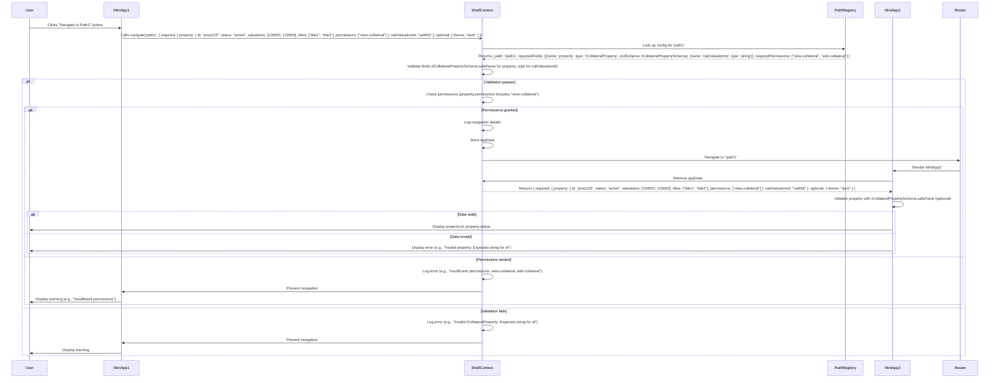

### Assumptions and Clarifications
- **Permission Model**: I’ll assume permissions are determined based on a `role` or `permissions` field within `ICollateralProperty` (e.g., `permissions: string[]`). If your permission model differs (e.g., external API, separate user object), please clarify.
- **Permission Check**: Each path in `pathRegistry` will specify required permissions (e.g., `requiredPermissions: string[]`). The `navigate` function will check if the user’s `ICollateralProperty.permissions` includes at least one of the required permissions.
- **ICollateralProperty**: Continues to have attributes `id: string`, `status: string`, `valuations: array`, `titles: array`, with an added `permissions: string[]` for permission checking.
- **Fallback Behavior**: If the user lacks permission, navigation is prevented, an error is logged, and a warning is displayed to the user.
- **Microfrontend Compatibility**: Permissions and types are shared via Module Federation in the `shared-types` package.

---

### Updated Solution Overview
The solution will:
1. Extend `ICollateralPropertySchema` to include a `permissions: string[]` field for permission checking.
2. Update `pathRegistry` to include `requiredPermissions` for each path.
3. Modify the `navigate` function in `ShellContext` to validate permissions using `ICollateralProperty.permissions`.
4. Update miniapp examples to handle permission errors.
5. Provide a script to refactor `webPath` with `ICollateralProperty` and permission requirements.
6. Update the User Story and Mermaid sequence diagram to include permission checking.

---

### 1. Updated Types and Zod Schemas
We’ll add `permissions` to `ICollateralPropertySchema` and include `requiredPermissions` in `PathConfig`.

```typescript
// shared-types/index.ts
import { z } from 'zod';

// Define ICollateralProperty schema with permissions
export const ICollateralPropertySchema = z.object({
  id: z.string(),
  status: z.string(),
  valuations: z.array(z.any()), // Specify type if needed (e.g., z.number())
  titles: z.array(z.any()), // Specify type if needed (e.g., z.string())
  permissions: z.array(z.string()), // Permissions as string array
});

export type ICollateralProperty = z.infer<typeof ICollateralPropertySchema>;

export type PrimitiveType = 'string' | 'number' | 'boolean';
export type ComplexType = 'ICollateralProperty';

export interface FieldConfig {
  name: string;
  type: PrimitiveType | ComplexType;
  zodSchema?: z.ZodSchema;
}

export interface AppData {
  required: Record<string, string | number | boolean | ICollateralProperty>;
  optional?: Record<string, any>;
}

export interface PathConfig {
  path: string;
  requiredFields: FieldConfig[];
  optionalFields?: FieldConfig[];
  requiredPermissions?: string[]; // Permissions needed to access the path
}

export const pathRegistry: Record<string, PathConfig> = {
  path1: {
    path: '/path1',
    requiredFields: [
      { name: 'property', type: 'ICollateralProperty', zodSchema: ICollateralPropertySchema },
      { name: 'nabValuationId', type: 'string' },
    ],
    optionalFields: [{ name: 'theme', type: 'string' }],
    requiredPermissions: ['view-collateral', 'edit-collateral'], // Example permissions
  },
  path2: {
    path: '/path2',
    requiredFields: [{ name: 'userId', type: 'string' }],
    optionalFields: [{ name: 'categoryId', type: 'number' }],
    requiredPermissions: ['view-user'], // Example permissions
  },
};
```

**Key Changes**:
- Added `permissions: z.array(z.string())` to `ICollateralPropertySchema`.
- Added `requiredPermissions` to `PathConfig` for permission requirements.
- `pathRegistry` includes `requiredPermissions` for each path (e.g., `view-collateral` for `path1`).

---

### 2. Updated `ShellContext` with Permission Checking
The `navigate` function now checks if `ICollateralProperty.permissions` includes at least one of the `requiredPermissions`.

```typescript
// shell/src/ShellContext.tsx
import { createContext, useContext, useState } from 'react';
import { useNavigate } from 'react-router-dom';
import { pathRegistry, AppData, FieldConfig, PrimitiveType, ICollateralProperty } from 'shared-types';
import { z } from 'zod';

interface ShellContextType {
  appData: Record<string, AppData>;
  navigate: (pathKey: string, data: AppData) => void;
}

const ShellContext = createContext<ShellContextType | undefined>(undefined);

export const ShellProvider: React.FC = ({ children }) => {
  const [appData, setAppData] = useState<Record<string, AppData>>({});
  const navigate = useNavigate();

  const validatePrimitiveType = (field: FieldConfig, value: any): boolean => {
    switch (field.type as PrimitiveType) {
      case 'string':
        return typeof value === 'string';
      case 'number':
        return typeof value === 'number';
      case 'boolean':
        return typeof value === 'boolean';
      default:
        return false;
    }
  };

  const checkPermissions = (property: ICollateralProperty, requiredPermissions: string[]): boolean => {
    if (!requiredPermissions || requiredPermissions.length === 0) return true; // No permissions required
    return requiredPermissions.some((perm) => property.permissions.includes(perm));
  };

  const customNavigate = (pathKey: string, data: AppData) => {
    const config = pathRegistry[pathKey];
    if (!config) {
      console.error(`Path key "${pathKey}" not found in pathRegistry`);
      return;
    }

    // Validate required fields
    const missingFields = config.requiredFields.filter(
      (field) => !(field.name in data.required)
    );
    const invalidTypes: string[] = [];

    config.requiredFields.forEach((field) => {
      if (!(field.name in data.required)) return;
      const value = data.required[field.name];
      if (field.zodSchema) {
        const result = field.zodSchema.safeParse(value);
        if (!result.success) {
          invalidTypes.push(
            `${field.name} (expected ${field.type}): ${result.error.issues
              .map((issue) => issue.message)
              .join(', ')}`
          );
        }
      } else if (!validatePrimitiveType(field, value)) {
        invalidTypes.push(`${field.name} (expected ${field.type})`);
      }
    });

    if (missingFields.length > 0) {
      console.error(
        `Navigation to ${config.path} failed: Missing required fields: ${missingFields
          .map((f) => f.name)
          .join(', ')}`
      );
      return;
    }

    if (invalidTypes.length > 0) {
      console.error(`Navigation to ${config.path} failed: Invalid types: ${invalidTypes.join(', ')}`);
      return;
    }

    // Check permissions
    const property = data.required.property as ICollateralProperty;
    if (!checkPermissions(property, config.requiredPermissions || [])) {
      console.error(
        `Navigation to ${config.path} failed: User lacks required permissions: ${config.requiredPermissions.join(', ')}`
      );
      return;
    }

    console.log(`Navigating to ${config.path} with data:`, JSON.stringify(data, null, 2));
    setAppData((prev) => ({ ...prev, [config.path]: data }));
    navigate(config.path);
  };

  return (
    <ShellContext.Provider value={{ appData, navigate: customNavigate }}>
      {children}
    </ShellContext.Provider>
  );
};

export const useShell = () => {
  const context = useContext(ShellContext);
  if (!context) throw new Error('useShell must be used within ShellProvider');
  return context;
};
```

**Key Changes**:
- Added `checkPermissions` to verify if `ICollateralProperty.permissions` includes any of the `requiredPermissions`.
- Permission check occurs after field validation, preventing navigation if permissions are insufficient.
- Logs detailed permission errors (e.g., “User lacks required permissions: view-collateral”).

---

### 3. Updated Miniapp Example
Miniapps handle permission errors and use `ICollateralProperty` with `permissions`.

```typescript
// mini-app1/src/App.tsx
import { useShell } from 'shell/ShellContext';
import { ICollateralProperty, ICollateralPropertySchema } from 'shared-types';

const App = () => {
  const { navigate } = useShell();
  const [error, setError] = useState<string | null>(null);

  const handleNavigate = () => {
    setError(null);
    const property: ICollateralProperty = {
      id: 'prop123',
      status: 'active',
      valuations: [100000, 120000],
      titles: ['title1', 'title2'],
      permissions: ['view-collateral'], // Example permissions
    };
    try {
      navigate('path1', {
        required: { property, nabValuationId: 'val456' },
        optional: { theme: 'dark' },
      });
    } catch (e) {
      setError('Navigation failed: Insufficient permissions or invalid data');
    }
  };

  return (
    <div>
      {error && <div style={{ color: 'red' }}>{error}</div>}
      <button onClick={handleNavigate}>Go to Path1</button>
    </div>
  );
};

export default App;

// mini-app2/src/App.tsx
import { useLocation } from 'react-router-dom';
import { useShell } from 'shell/ShellContext';
import { ICollateralProperty, ICollateralPropertySchema } from 'shared-types';

const App = () => {
  const { appData } = useShell();
  const { pathname } = useLocation();
  const data = appData[pathname] || { required: {} };

  const property = data.required.property;
  const result = ICollateralPropertySchema.safeParse(property);
  if (!result.success) {
    return (
      <div>
        Error: Invalid property data - {result.error.issues.map((issue) => issue.message).join(', ')}
      </div>
    );
  }

  return (
    <div>
      Property: {result.data.id} (Status: {result.data.status})
      <br />
      Valuations: {result.data.valuations.join(', ')}
      <br />
      Titles: {result.data.titles.join(', ')}
      <br />
      Permissions: {result.data.permissions.join(', ')}
    </div>
  );
};

export default App;
```

**Key Changes**:
- `MiniApp1` adds error handling for navigation failures (e.g., insufficient permissions).
- `property` includes a `permissions` field.
- `MiniApp2` displays `permissions` for demonstration.

---

### 4. Refactoring `webPath`
The script updates `webPath` to `pathRegistry` with `ICollateralPropertySchema`, `nabValuationId`, and default permissions.

```typescript
// generatePathRegistry.ts
import { PathConfig, FieldConfig, ICollateralPropertySchema } from 'shared-types';

const webPath = {
  path1: '/path1',
  path2: '/path2',
  // ... other paths
};

const defaultRequiredFields: FieldConfig[] = [
  { name: 'property', type: 'ICollateralProperty', zodSchema: ICollateralPropertySchema },
  { name: 'nabValuationId', type: 'string' },
];

const defaultPermissions = ['view-collateral']; // Default permissions

const pathRegistry = Object.keys(webPath).reduce(
  (acc, key) => ({
    ...acc,
    [key]: {
      path: webPath[key],
      requiredFields: defaultRequiredFields,
      optionalFields: [],
      requiredPermissions: defaultPermissions,
    },
  }),
  {} as Record<string, PathConfig>
);

console.log(JSON.stringify(pathRegistry, null, 2));
```

**Steps**:
1. Ensure `zod` is installed: `yarn add zod`.
2. Run the script to generate `pathRegistry`.
3. Manually adjust `requiredPermissions` and fields for paths as needed.
4. Update navigation calls to include `ICollateralProperty.permissions`.

---

### 5. Updated User Story with Permission Checking


# User Story: Standardize Navigation with Zod-Based Complex Type Validation and Permission Checking for ICollateralProperty in Microfrontend Application

## Title
As a developer, I want to standardize navigation and data passing with complex type validation using the `zod` library and permission checking for `ICollateralProperty` in the microfrontend application, so that only authorized users can access destination pages with correctly typed data (e.g., `ICollateralProperty`, `nabValuationId`), reducing errors and improving security and maintainability.

## Description
In our React microfrontend application, we have a shell application hosting multiple miniapps. Navigation between pages is defined in a `webPath` object (e.g., `{'path1': '/path1', 'path2': '/path2'}`) and managed by a `navigate` function that passes data via `appData` stored in the shell’s context. The `appData` includes complex types like `ICollateralProperty` (e.g., `{ id: string, status: string, valuations: array, titles: array, permissions: string[] }`) and primitives like `nabValuationId`. Currently, there’s no mechanism to validate user permissions before navigating to a destination page, risking unauthorized access. Additionally, validating complex types by checking individual properties is cumbersome. We need a solution to define typed `appData` requirements and required permissions for each path, validate `ICollateralProperty` using `zod` schemas, check user permissions via `ICollateralProperty.permissions`, and refactor existing paths efficiently.

## As a
Developer

## I want to
Standardize the navigation process with validation for complex types like `ICollateralProperty` using `zod` schemas, check user permissions before navigating, and use `nabValuationId` for relevant paths

## So that
I can ensure only authorized users access destination pages with correctly typed data, reduce runtime errors, enhance security, improve debugging with detailed error messages, and refactor existing paths efficiently in our microfrontend architecture.

## Acceptance Criteria

1. **Path Registry with Zod Schema and Permission Support**:
   - A centralized `pathRegistry` maps each path key to its actual path, required/optional `appData` fields (e.g., `property: ICollateralProperty`, `nabValuationId: string`), and required permissions (e.g., `view-collateral`).
   - Example: For `path1`, required fields are `property: ICollateralProperty` (validated by `zod` with `id`, `status`, `valuations`, `titles`, `permissions`) and `nabValuationId: string`, with permissions `view-collateral` or `edit-collateral`.
   - The `pathRegistry` is defined using TypeScript interfaces and `zod` schemas for type safety.
   - Supports dynamic updates for adding paths or permissions.
   - Complex types are validated using `zod` schemas (e.g., `ICollateralPropertySchema`).

2. **Navigation Function with Zod Validation and Permission Checking**:
   - The `navigate` function accepts a `pathKey` and an `appData` object.
   - Validates required fields using `zod` schemas (e.g., `ICollateralPropertySchema.safeParse`) for complex types and type checks for primitives.
   - Checks if `ICollateralProperty.permissions` includes at least one of the `requiredPermissions` for the destination path.
   - Validation or permission failures log detailed errors (e.g., “Invalid ICollateralProperty: Expected string for id” or “User lacks required permissions: view-collateral”) and prevent navigation.
   - Stores `appData` in the context for the destination page.
   - TypeScript infers types from `zod` schemas for safe usage.

3. **Data Access in Destination Pages**:
   - Destination pages retrieve `appData` using the current `pathname`.
   - If data is missing or invalid (e.g., fails `ICollateralPropertySchema.safeParse`), a user-friendly error message with `zod` details is displayed.
   - Pages are wrapped in an `ErrorBoundary` to prevent crashes.

4. **Refactoring Existing Paths**:
   - A script converts `webPath` into `pathRegistry`, including `zod` schemas for `ICollateralProperty`, `nabValuationId`, and default permissions.
   - Minimizes changes to navigation calls (e.g., `navigate('path1', { required: { property: ICollateralProperty, nabValuationId } })`).
   - Provides a script to refactor many paths with minimal disruption.
   - Validates paths for complete type and permission definitions.

5. **Debugging Support**:
   - The `navigate` function logs path key, destination path, `appData`, validation results, and permission checks (e.g., “Invalid ICollateralProperty” or “Insufficient permissions”).
   - Logs include timestamps and source page for tracing.
   - Debug mode warns about missing optional fields.
   - Destination page errors are logged with `zod` details and context.

6. **Type Safety and Developer Experience**:
   - TypeScript enforces type safety for `pathKey`, `appData`, and permissions, with autocompletion for `ICollateralProperty` fields and `requiredPermissions`.
   - JSDoc comments document fields, schemas, and permissions.
   - A utility generates TypeScript types from `pathRegistry` and `zod` schemas.

7. **Scalability for Microfrontend Architecture**:
   - `pathRegistry`, `zod` schemas, and permissions are shared via a `shared-types` package with Module Federation.
   - Miniapps validate navigation using `pathRegistry` and `zod` schemas.
   - Supports nested routes with typed `appData` and permissions.

8. **Handling Edge Cases**:
   - Undefined `pathKey` logs an error and prevents navigation.
   - Direct page access checks for missing/invalid `appData` or permissions, redirecting to a fallback or displaying an error.
   - Handles multiple source pages with context-specific requirements.

9. **Performance Optimization**:
   - Minimizes context updates for `appData`.
   - Loads `pathRegistry` and `zod` schemas efficiently.
   - Ensures validation and permission checks take <10ms, monitored via logs.

10. **Testing and Validation**:
    - Unit tests verify `navigate` for field presence, type correctness, and permission checks using `zod` schemas.
    - Integration tests ensure navigation respects permissions and passes typed `appData`.
    - A test script validates `pathRegistry` for completeness.
    - Linter warns for undefined `pathKey` or incorrect types.

11. **Zod-Based Validation and Permission Checking**:
    - `pathRegistry` defines types and permissions for each field.
    - `navigate` validates `appData` using `zod` schemas and checks `ICollateralProperty.permissions` against `requiredPermissions`.
    - Logs detailed `zod` errors and permission failures.
    - Destination pages assume valid data after `zod` validation.

12. **Visualization of Navigation Flow**:
    - A Mermaid sequence diagram visualizes navigation, including:
      - User interaction to initiate navigation.
      - Validation of `appData` using `zod` schemas.
      - Permission checking via `ICollateralProperty.permissions`.
      - Storage of `appData` and navigation.
      - Retrieval and validation in the destination miniapp.
      - Error handling for invalid data or permissions.
    - Includes participants: User, MiniApp1, ShellContext, PathRegistry, MiniApp2, Router.

## Notes
- **Zod Integration**: Validates `ICollateralProperty` with `id`, `status`, `valuations`, `titles`, and `permissions` using `zod`, avoiding manual property checks.
- **Permission Checking**: Ensures users have required permissions before navigating, enhancing security.
- **Refactoring**: Script automates `webPath` conversion with `ICollateralProperty`, `nabValuationId`, and permissions.
- **Microfrontend Compatibility**: Module Federation shares `zod` schemas, types, and permissions.
- **Alignment with Diagram**: The sequence diagram reflects `zod` validation and permission checks.

## Reference: Mermaid Sequence Diagram
The following sequence diagram visualizes the navigation and validation process with `zod` and permission checking:




---

### Additional Notes
- **Permission Model**: Assumes permissions are stored in `ICollateralProperty.permissions`. If permissions come from another source (e.g., API, separate user object), please clarify.
- **Zod Validation**: Continues to validate `ICollateralProperty` efficiently, with `permissions` as a string array.
- **Error Handling**: Permission failures trigger clear error messages and warnings in the source miniapp.
- **Refactoring**: The script includes default permissions, adjustable per path.
- **Microfrontend Compatibility**: Module Federation shares `zod`, types, and permissions across miniapps.

---

### Example Unit Test
```typescript
// navigate.test.ts
import { renderHook, act } from '@testing-library/react-hooks';
import { ShellProvider, useShell } from './ShellContext';
import { ICollateralPropertySchema } from 'shared-types';

test('navigate validates ICollateralProperty and permissions', () => {
  const wrapper = ({ children }) => <ShellProvider>{children}</ShellProvider>;
  const { result } = renderHook(() => useShell(), { wrapper });

  const consoleError = jest.spyOn(console, 'error').mockImplementation();

  // Test insufficient permissions
  act(() => {
    result.current.navigate('path1', {
      required: {
        property: {
          id: 'prop123',
          status: 'active',
          valuations: [100000],
          titles: ['title1'],
          permissions: ['view-user'], // Missing view-collateral
        },
        nabValuationId: 'val456',
      },
    });
  });
  expect(consoleError).toHaveBeenCalledWith(
    expect.stringContaining('User lacks required permissions: view-collateral, edit-collateral')
  );

  // Test valid data and permissions
  act(() => {
    result.current.navigate('path1', {
      required: {
        property: {
          id: 'prop123',
          status: 'active',
          valuations: [100000],
          titles: ['title1'],
          permissions: ['view-collateral'],
        },
        nabValuationId: 'val456',
      },
    });
  });
  expect(consoleError).not.toHaveBeenCalled();
});
```

---

### Next Steps
- **Confirm Permission Model**: If permissions are managed differently (e.g., API call, separate user object), please provide details.
- **Specify Array Types**: If `valuations` or `titles` have specific types (e.g., numbers, objects), share them for a refined `zod` schema.
- **Implementation**: I can provide a full monorepo setup, additional tests, or a detailed Module Federation configuration.
- **Refactoring**: Share a sample `webPath` for a tailored script.
- **Alternative Diagrams**: If you prefer a class diagram or flowchart, I can generate one.
