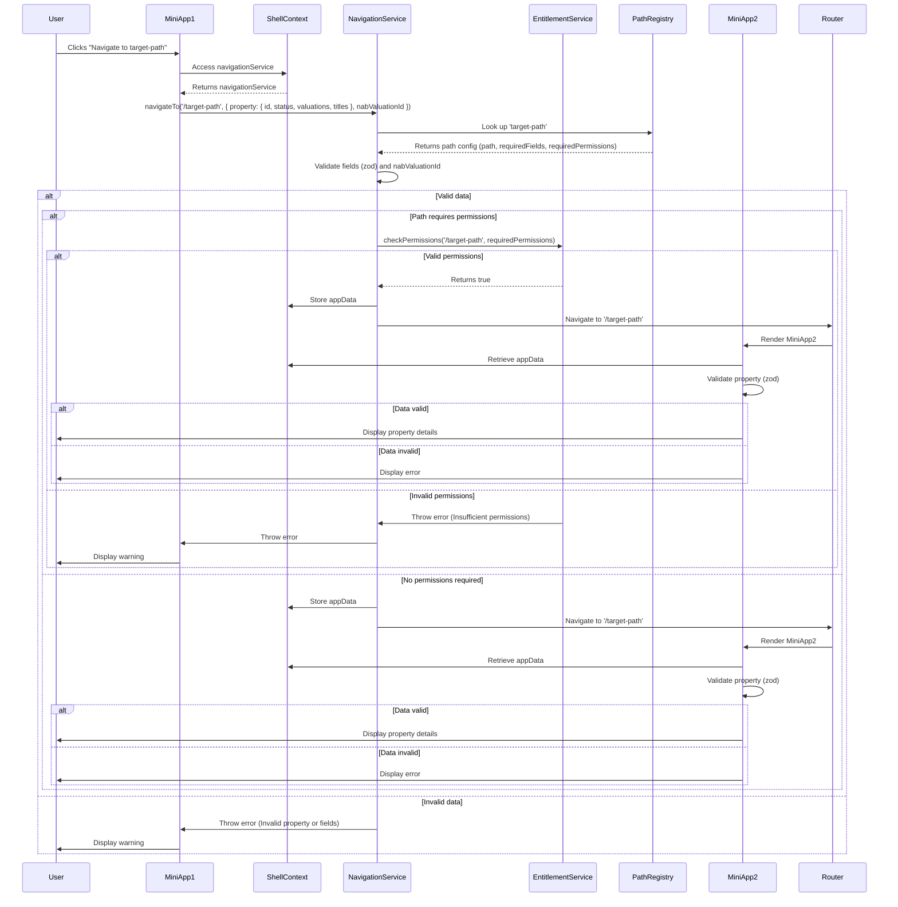

### Assumptions
- **Permission Check**: The `checkPermissions(path: string, requiredPermissions: string[])` method validates permissions based solely on the path name and the `requiredPermissions` from `pathRegistry`. Since you didn’t specify how permissions are sourced, I’ll assume a static permission store (e.g., a mock mapping of paths to user permissions) for now. If permissions are fetched from an API or another source, please provide details.
- **Path-Based Logic**: Permission checks are only applied for paths with `requiredPermissions` in `pathRegistry`. Paths without `requiredPermissions` skip the check.
- **No Property Dependency**: The `property` object is still validated with `zod` in `NavigationService`, but it’s not used for permission checks.
- **Existing Architecture**: The solution integrates with your TypeScript-based React microfrontend application, using `zod`, `ShellContext`, and Module Federation.

### Updated Mermaid Sequence Diagram

The sequence diagram is updated to reflect that `checkPermissions` takes `path` and `requiredPermissions` as arguments, removing the dependency on `ICollateralProperty` for permission validation.



### Changes in the Diagram
- **checkPermissions Call**: Updated to `checkPermissions('/target-path', requiredPermissions)`, passing the path name instead of the `property` object.
- **No API Call**: Removed the `API` participant and `fetchPermissions` call, as the permission check is now based on the path name and `requiredPermissions`.
- **Conditional Logic**: Retained the `alt Path requires permissions` block to skip permission checks for paths without `requiredPermissions`.

### Updated Implementation

Below is the revised `EntitlementService` and `NavigationService` implementation, where `checkPermissions` takes `path: string` and `requiredPermissions: string[]` as parameters. I’ve included a mock permission store for demonstration, which can be replaced with your actual permission source (e.g., API, user session).

```typescript
import { z } from 'zod';

// Define schemas for ICollateralProperty
const ICollateralPropertySchema = z.object({
  id: z.string(),
  status: z.string(),
  valuations: z.array(z.unknown()), // Placeholder, update with specific schema if provided
  titles: z.array(z.unknown()), // Placeholder, update with specific schema if provided
});

type ICollateralProperty = z.infer<typeof ICollateralPropertySchema>;

// Path configuration type
type PathConfig = {
  path: string;
  requiredFields: string[];
  requiredPermissions?: string[]; // Optional to allow paths without permission checks
};

// Sample path registry
const pathRegistry: Record<string, PathConfig> = {
  'target-path': {
    path: '/target-path',
    requiredFields: ['property', 'nabValuationId'],
    requiredPermissions: ['view-collateral'],
  },
  'public-path': {
    path: '/public-path',
    requiredFields: ['property'],
    // No requiredPermissions, so checkPermissions is skipped
  },
};

// Mock permission store (replace with actual permission source, e.g., user session or API)
const userPermissionsByPath: Record<string, string[]> = {
  '/target-path': ['view-collateral'],
  '/public-path': [], // No permissions needed
};

// EntitlementService to handle permission checks based on path
export class EntitlementService {
  constructor() {}

  /**
   * Checks if the user has all required permissions for the given path.
   * @param path - The path to check permissions for (e.g., '/target-path').
   * @param requiredPermissions - Array of required permissions for the path.
   * @returns True if all permissions are present, else throws an error.
   */
  checkPermissions(path: string, requiredPermissions: string[]): boolean {
    // Get user permissions for the path (mock for now)
    const userPermissions = userPermissionsByPath[path] || [];

    // Validate permissions
    const hasPermissions = requiredPermissions.every((perm) => userPermissions.includes(perm));
    if (!hasPermissions) {
      throw new Error(
        `Insufficient permissions for path ${path}: Required ${requiredPermissions.join(', ')}, but found ${userPermissions.join(', ')}`
      );
    }
    return true;
  }
}

// Updated NavigationService to apply checkPermissions only for paths with requiredPermissions
export class NavigationService {
  constructor(
    private navigate: (path: string) => void,
    private setAppData: (data: any) => void,
    private entitlementService: EntitlementService
  ) {}

  /**
   * Navigates to a path after validating data and permissions (if required).
   * @param pathKey - Key in pathRegistry.
   * @param appData - Data containing property and optional nabValuationId.
   */
  navigateTo(pathKey: string, appData: { property: ICollateralProperty; nabValuationId?: string }) {
    const config = pathRegistry[pathKey];
    if (!config) {
      throw new Error(`Invalid pathKey: ${pathKey}`);
    }

    // Validate required fields
    config.requiredFields.forEach((field) => {
      if (!appData[field]) {
        throw new Error(`Missing required field: ${field}`);
      }
    });

    // Validate property with zod
    const parsedProperty = ICollateralPropertySchema.safeParse(appData.property);
    if (!parsedProperty.success) {
      throw new Error(`Invalid property: ${parsedProperty.error.message}`);
    }

    // Validate nabValuationId if provided
    if (appData.nabValuationId && typeof appData.nabValuationId !== 'string') {
      throw new Error('Invalid nabValuationId: must be a string');
    }

    // Check permissions only if required by the path
    if (config.requiredPermissions && config.requiredPermissions.length > 0) {
      this.entitlementService.checkPermissions(config.path, config.requiredPermissions);
    }

    // Store appData and navigate
    this.setAppData(appData);
    this.navigate(config.path);
  }
}
```

### Key Changes
1. **EntitlementService**:
   - Updated `checkPermissions(path: string, requiredPermissions: string[])` to validate permissions based on the path name.
   - Removed dependency on `ICollateralProperty` for permission checks.
   - Added a mock `userPermissionsByPath` store to simulate path-based permissions. Replace this with your actual permission source (e.g., user session, API).
   - Made `checkPermissions` synchronous for simplicity, as the mock store is static. If permissions are fetched asynchronously, I can revert to an async method.

2. **NavigationService**:
   - Calls `entitlementService.checkPermissions(config.path, config.requiredPermissions)` only if `requiredPermissions` exist for the path.
   - Passes `config.path` (e.g., `/target-path`) instead of `property`.
   - Removed async from `navigateTo`, as `checkPermissions` is now synchronous (can be reverted if async is needed).

3. **PathRegistry**:
   - Kept `requiredPermissions` optional to support paths like `public-path` that skip permission checks.
   - Ensured `config.path` is passed to `checkPermissions` for path-based validation.

4. **ICollateralPropertySchema**:
   - Removed `permissions` field, as it’s no longer used for permission checks.
   - Kept `valuations` and `titles` as placeholders (`z.unknown()`) pending your input.

5. **Sequence Diagram**:
   - Updated `checkPermissions` call to use `path` (`/target-path`) instead of `property`.
   - Removed `API` participant, as permissions are now path-based (mock store for now).
   - Retained conditional logic for paths with/without `requiredPermissions`.

### Integration
- **ShellContext**: No changes needed; provide `EntitlementService` and `NavigationService` as before:
  ```typescript
  const entitlementService = useMemo(() => new EntitlementService(), []);
  const navigationService = useMemo(
    () => new NavigationService(navigate, setAppData, entitlementService),
    [navigate, setAppData]
  );
  ```
- **MiniApp1**: Call `navigationService.navigateTo` as before; no changes required.
- **MiniApp2**: Continues to validate `appData.property` with `zod` and display details or errors.
- **Module Federation**: Share `EntitlementService` via `shared-types` package:
  ```javascript
  new ModuleFederationPlugin({
    name: 'sharedTypes',
    filename: 'remoteEntry.js',
    exposes: {
      './entitlementService': './src/entitlement-service.ts',
      './types': './src/types.ts',
    },
    shared: { zod: { singleton: true } },
  });
  ```

### Testing
Sample Jest test for the updated `EntitlementService`:

```typescript
describe('EntitlementService', () => {
  const entitlementService = new EntitlementService();

  test('should pass for valid permissions', () => {
    expect(() => entitlementService.checkPermissions('/target-path', ['view-collateral'])).not.toThrow();
  });

  test('should throw for insufficient permissions', () => {
    expect(() => entitlementService.checkPermissions('/target-path', ['edit-collateral'])).toThrow(
      /Insufficient permissions for path/
    );
  });

  test('should pass for path with no permissions', () => {
    expect(() => entitlementService.checkPermissions('/public-path', [])).not.toThrow();
  });
});
```

### Performance Considerations
- **Permission Checks**: Using a static `userPermissionsByPath` ensures checks are fast (<1ms). If permissions are fetched from an API, caching is recommended.
- **Zod Validation**: Reusing `ICollateralPropertySchema` keeps validation efficient (<10ms, per your requirement).
- **Conditional Logic**: Skipping `checkPermissions` for paths without `requiredPermissions` reduces overhead.

### Questions for You
1. **Permission Source**: How are permissions for a path determined? Are they stored in a user session, fetched from an API, or elsewhere? Please provide details (e.g., API endpoint, session structure).
2. **Array Types**: Can you specify the structures of `valuations` and `titles` for a refined `zod` schema?
3. **Path Examples**: Are there specific paths or `pathRegistry` entries to include (e.g., more public or restricted paths)?
4. **Async Needs**: Should `checkPermissions` be async (e.g., for API calls)? If so, provide API details.
5. **Additional Features**: Need logging, analytics, or a monorepo setup?

### Next Steps
- Provide permission source details to replace the mock `userPermissionsByPath`.
- Share `valuations` and `titles` structures for an updated `zod` schema.
- Confirm if you need a monorepo, additional tests, or a refined diagram (e.g., with error cases).
