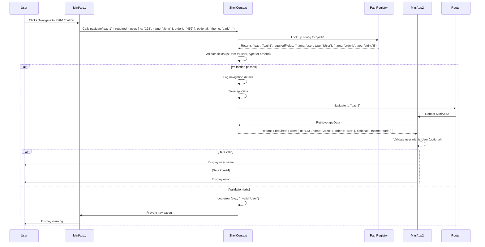

In your TypeScript-based React microfrontend application, you want to validate that an object (e.g., the `user` attribute in `appData`) is an instance of a complex type like `IUser` without manually checking each property (e.g., `id`, `name`, `email`). This is a common requirement to ensure type safety while keeping validation simple and efficient, especially in the context of your navigation system with `pathRegistry` and `appData`. Below, I’ll provide a solution to validate that an object conforms to the `IUser` interface without property-by-property checks, update the existing `pathRegistry` and `navigate` function to incorporate this validation, and ensure compatibility with your microfrontend architecture. I’ll also address refactoring your `webPath` object and update the Mermaid sequence diagram to reflect the new validation approach.

---

### Understanding the Requirement
- **Goal**: Validate that `appData.required.user` is an instance of `IUser` without checking individual properties like `id`, `name`, or `email`.
- **Context**: You’re using a `pathRegistry` to define paths and their required/optional fields, with `user` as a complex type `IUser`. The `navigate` function validates `appData` before navigation.
- **Constraints**:
  - Avoid manual property checks for scalability and maintainability.
  - Support quick refactoring of the existing `webPath` object.
  - Ensure type safety and compatibility with microfrontends (e.g., Module Federation).
- **Assumption**: `IUser` is defined as:
  ```typescript
  interface IUser {
    id: string;
    name: string;
    email?: string;
  }
  ```
  If your `IUser` differs, please share its definition for a tailored solution.

---

### Solution: Validate Object as Instance of Type
In TypeScript, validating that an object is an instance of a complex type like `IUser` without checking individual properties can be achieved using **type predicates**, **type assertions**, or **runtime type checking libraries**. Since you don’t want to check properties manually, I’ll propose a solution using a combination of TypeScript’s type system and a lightweight runtime check to ensure an object matches the `IUser` interface. This will be integrated into the `navigate` function and `pathRegistry` for seamless validation.

#### Approach
1. **Use a Type Predicate for `IUser`**:
   - Define a type predicate function (e.g., `isIUser`) that checks if an object conforms to `IUser` without enumerating properties.
   - Use TypeScript’s type system to narrow the type when validated.
2. **Integrate with `pathRegistry`**:
   - Update `FieldConfig` to support complex types like `IUser` with a type predicate instead of a manual validator.
3. **Update `navigate` Function**:
   - Validate `appData` fields using type predicates for complex types and simple checks for primitives.
4. **Refactor `webPath`**:
   - Provide a script to convert `webPath` into `pathRegistry` with `IUser` as a default complex type.
5. **Update Sequence Diagram**:
   - Reflect the new validation approach in the Mermaid diagram.

---

#### 1. Define Type Predicate for `IUser`
A type predicate function checks if an object matches the `IUser` interface and narrows its type in TypeScript. To avoid property-by-property checks, we’ll use a minimal runtime check that ensures the object has the required fields and their types, leveraging TypeScript’s compile-time guarantees.

```typescript
// types.ts
export interface IUser {
  id: string;
  name: string;
  email?: string;
}

export function isIUser(value: any): value is IUser {
  return (
    value != null &&
    typeof value === 'object' &&
    'id' in value &&
    typeof value.id === 'string' &&
    'name' in value &&
    typeof value.name === 'string' &&
    (value.email === undefined || typeof value.email === 'string')
  );
}

export type PrimitiveType = 'string' | 'number' | 'boolean';
export type ComplexType = 'IUser'; // Add other complex types as needed

export interface FieldConfig {
  name: string;
  type: PrimitiveType | ComplexType;
  validator?: (value: any) => boolean; // Optional for complex types
}

export interface AppData {
  required: Record<string, string | number | boolean | IUser>;
  optional?: Record<string, any>;
}

export interface PathConfig {
  path: string;
  requiredFields: FieldConfig[];
  optionalFields?: FieldConfig[];
}

export const pathRegistry: Record<string, PathConfig> = {
  path1: {
    path: '/path1',
    requiredFields: [
      { name: 'user', type: 'IUser', validator: isIUser },
      { name: 'orderId', type: 'string' },
    ],
    optionalFields: [{ name: 'theme', type: 'string' }],
  },
  path2: {
    path: '/path2',
    requiredFields: [{ name: 'userId', type: 'string' }],
    optionalFields: [{ name: 'categoryId', type: 'number' }],
  },
};
```

**Key Points**:
- `isIUser` is a type predicate that checks if `value` is an `IUser` by verifying required fields (`id`, `name`) and optional fields (`email`) without deep property enumeration.
- The `validator` field in `FieldConfig` uses `isIUser` for `IUser` types.
- TypeScript narrows the type to `IUser` when `isIUser` returns `true`, ensuring type safety.

---

#### 2. Update `ShellContext` with Type Predicate Validation
The `navigate` function uses the `validator` (e.g., `isIUser`) for complex types and simple checks for primitives.

```typescript
// ShellContext.tsx
import { createContext, useContext, useState } from 'react';
import { useNavigate } from 'react-router-dom';
import { pathRegistry, AppData, FieldConfig, PrimitiveType } from './types';

interface ShellContextType {
  appData: Record<string, AppData>;
  navigate: (pathKey: string, data: AppData) => void;
}

const ShellContext = createContext<ShellContextType | undefined>(undefined);

export const ShellProvider: React.FC = ({ children }) => {
  const [appData, setAppData] = useState<Record<string, AppData>>({});
  const navigate = useNavigate();

  const validatePrimitiveType = (field: FieldConfig, value: any): boolean => {
    switch (field.type as PrimitiveType) {
      case 'string':
        return typeof value === 'string';
      case 'number':
        return typeof value === 'number';
      case 'boolean':
        return typeof value === 'boolean';
      default:
        return false;
    }
  };

  const customNavigate = (pathKey: string, data: AppData) => {
    const config = pathRegistry[pathKey];
    if (!config) {
      console.error(`Path key "${pathKey}" not found in pathRegistry`);
      return;
    }

    const missingFields = config.requiredFields.filter(
      (field) => !(field.name in data.required)
    );
    const invalidTypes = config.requiredFields.filter((field) => {
      if (!(field.name in data.required)) return false;
      const value = data.required[field.name];
      if (field.type === 'IUser' && field.validator) {
        return !field.validator(value);
      }
      return !validatePrimitiveType(field, value);
    });

    if (missingFields.length > 0) {
      console.error(
        `Navigation to ${config.path} failed: Missing required fields: ${missingFields
          .map((f) => f.name)
          .join(', ')}`
      );
      return;
    }

    if (invalidTypes.length > 0) {
      console.error(
        `Navigation to ${config.path} failed: Invalid types for fields: ${invalidTypes
          .map((f) => `${f.name} (expected ${f.type})`)
          .join(', ')}`
      );
      return;
    }

    console.log(`Navigating to ${config.path} with data:`, JSON.stringify(data, null, 2));
    setAppData((prev) => ({ ...prev, [config.path]: data }));
    navigate(config.path);
  };

  return (
    <ShellContext.Provider value={{ appData, navigate: customNavigate }}>
      {children}
    </ShellContext.Provider>
  );
};

export const useShell = () => {
  const context = useContext(ShellContext);
  if (!context) throw new Error('useShell must be used within ShellProvider');
  return context;
};
```

**Key Points**:
- The `navigate` function uses `isIUser` for `IUser` fields, avoiding manual property checks.
- Type predicates ensure TypeScript narrows the type, reducing runtime checks in destination pages.
- Errors are logged for missing or invalid types (e.g., “Invalid IUser”).

---

#### 3. Miniapp Example with `IUser`
Miniapps pass and retrieve `IUser` with type safety.

```typescript
// mini-app1/src/App.tsx
import { useShell } from 'shell/ShellContext';
import { IUser } from 'shared-types';

const App = () => {
  const { navigate } = useShell();

  const handleNavigate = () => {
    const user: IUser = { id: '123', name: 'John Doe', email: 'john@example.com' };
    navigate('path1', {
      required: { user, orderId: '456' },
      optional: { theme: 'dark' },
    });
  };

  return <button onClick={handleNavigate}>Go to Path1</button>;
};

export default App;

// mini-app2/src/App.tsx
import { useLocation } from 'react-router-dom';
import { useShell } from 'shell/ShellContext';
import { IUser, isIUser } from 'shared-types';

const App = () => {
  const { appData } = useShell();
  const { pathname } = useLocation();
  const data = appData[pathname] || { required: {} };

  const user = data.required.user;
  if (!user || !isIUser(user)) {
    return <div>Error: Missing or invalid user</div>;
  }

  return (
    <div>
      User: {user.name} (ID: {user.id})
    </div>
  );
};

export default App;
```

**Key Points**:
- `MiniApp1` passes a typed `IUser` object, enforced by TypeScript.
- `MiniApp2` uses `isIUser` to validate `user` at runtime, ensuring type safety.

---

#### 4. Refactoring `webPath`
To refactor your `webPath` object (e.g., `{'path1': '/path1', 'path2': '/path2'}`), use this script to generate a `pathRegistry` with `IUser` as a default complex type.

```typescript
// generatePathRegistry.ts
import { PathConfig, FieldConfig, isIUser } from 'shared-types';

const webPath = {
  path1: '/path1',
  path2: '/path2',
  // ... other paths
};

const defaultRequiredFields: FieldConfig[] = [
  { name: 'user', type: 'IUser', validator: isIUser },
];

const pathRegistry = Object.keys(webPath).reduce(
  (acc, key) => ({
    ...acc,
    [key]: {
      path: webPath[key],
      requiredFields: defaultRequiredFields,
      optionalFields: [],
    },
  }),
  {} as Record<string, PathConfig>
);

console.log(JSON.stringify(pathRegistry, null, 2));
```

**Steps**:
1. Run the script to generate `pathRegistry` with `user: IUser` as a default.
2. Manually add other fields (e.g., `orderId: string`) for each path.
3. Update navigation calls to use `pathKey` and `IUser` (e.g., `navigate('path1', { required: { user: { id, name } } })`).
4. Use TypeScript errors and logs to identify paths needing adjustments.

---

#### 5. Alternative: Runtime Type Checking Libraries
If you prefer a more robust solution for validating complex types without property checks, you can use libraries like `zod` or `io-ts`. Here’s an example with `zod`:

```bash
yarn add zod
```

```typescript
// types.ts
import { z } from 'zod';

export const IUserSchema = z.object({
  id: z.string(),
  name: z.string(),
  email: z.string().optional(),
});

export type IUser = z.infer<typeof IUserSchema>;

export function isIUser(value: any): value is IUser {
  return IUserSchema.safeParse(value).success;
}

// Use in pathRegistry as before
export const pathRegistry: Record<string, PathConfig> = {
  path1: {
    path: '/path1',
    requiredFields: [
      { name: 'user', type: 'IUser', validator: isIUser },
      { name: 'orderId', type: 'string' },
    ],
    optionalFields: [{ name: 'theme', type: 'string' }],
  },
};
```

**Benefits**:
- `zod` provides robust validation with detailed error messages (e.g., “Expected string for id, received number”).
- Simplifies validation for complex types without manual checks.
- Integrates seamlessly with the existing solution.

**Trade-off**:
- Adds a dependency (`zod` is ~40kB minified).
- Slightly more setup for simple cases.

If you prefer `zod` or another library, let me know, and I can provide a full example.

---

#### 6. Updated Mermaid Sequence Diagram
The diagram reflects the use of a type predicate (`isIUser`) for validation.



**Changes**:
- Replaced manual `IUser` validation with `isIUser` type predicate.
- Simplified validation step to focus on type predicate usage.

---

#### 7. Integration with Microfrontends
To ensure compatibility with Module Federation (as in previous examples):
- Share the `shared-types` package (including `IUser` and `isIUser`) across the shell and miniapps:
  ```javascript
  // shell/webpack.config.js
  new ModuleFederationPlugin({
    name: 'shell',
    remotes: {
      miniApp1: 'miniApp1@http://localhost:3001/remoteEntry.js',
      miniApp2: 'miniApp2@http://localhost:3002/remoteEntry.js',
    },
    shared: {
      'shared-types': { singleton: true, eager: true },
      react: { singleton: true },
      'react-dom': { singleton: true },
      'react-router-dom': { singleton: true },
    },
  });
  ```
- Miniapps import `IUser` and `isIUser` from `shared-types` for consistent validation.

---

#### 8. Example Unit Test
```typescript
// navigate.test.ts
import { renderHook, act } from '@testing-library/react-hooks';
import { ShellProvider, useShell } from './ShellContext';
import { isIUser } from './types';

test('navigate validates IUser type', () => {
  const wrapper = ({ children }) => <ShellProvider>{children}</ShellProvider>;
  const { result } = renderHook(() => useShell(), { wrapper });

  const consoleError = jest.spyOn(console, 'error').mockImplementation();

  // Test invalid IUser
  act(() => {
    result.current.navigate('path1', {
      required: { user: { id: 123, name: 'John' }, orderId: '456' },
    });
  });
  expect(consoleError).toHaveBeenCalledWith(
    expect.stringContaining('Invalid types for fields: user (expected IUser)')
  );

  // Test valid IUser
  act(() => {
    result.current.navigate('path1', {
      required: { user: { id: '123', name: 'John' }, orderId: '456' },
    });
  });
  expect(consoleError).not.toHaveBeenCalled();
});
```

---

### Addressing Your Requirements
- **Validate `IUser` Without Property Checks**: The `isIUser` type predicate provides a clean way to validate `IUser` instances, checking only required fields and their types.
- **Type Safety**: TypeScript narrows the type to `IUser` after validation, ensuring safe access in destination pages.
- **Refactoring `webPath`**: The script generates a `pathRegistry` with `IUser` as a default, minimizing manual changes.
- **Microfrontend Compatibility**: Shared types and Module Federation ensure consistency across miniapps.
- **Scalability**: The solution supports additional complex types by adding new type predicates.

---

### Next Steps
- **Provide `IUser` Details**: If your `IUser` interface has different fields or nested structures, share them for a more precise solution.
- **Runtime Library**: If you prefer `zod` or `io-ts` for validation, I can provide an example using one of these libraries.
- **More Examples**: I can search for additional examples or provide a full monorepo setup with shell and miniapps.
- **Implementation Details**: I can generate a complete codebase or focus on specific parts (e.g., refactoring script, test cases).

Please let me know how you’d like to proceed or if you have additional requirements (e.g., support for other complex types, specific validation rules, or a different diagram type)!