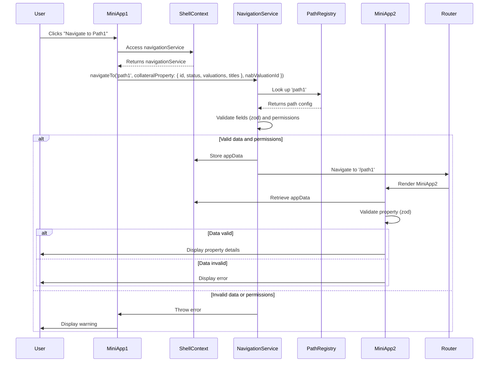

The solution enhances navigation in a TypeScript-based React microfrontend application by introducing a **NavigationService** to centralize logic, using `zod` for validating complex types like `ICollateralProperty` (`{ id: string, status: string, valuations: array, titles: array, permissions: string[] }`) without manual property checks, checking user permissions, and supporting efficient refactoring of the `webPath` object. Below is a summary of the key components and updates:

### Key Components
1. **NavigationService**:
   - A class encapsulating navigation logic, including:
     - **Path Lookup**: Uses `pathRegistry` to map `pathKey` (e.g., `path1`) to paths (e.g., `/view-collateral-details`).
     - **Data Validation**: Validates `appData` using `zod` schemas (e.g., `ICollateralPropertySchema`) for complex types and type checks for primitives like `nabValuationId`.
     - **Permission Checking**: Ensures `ICollateralProperty.permissions` includes at least one of the `requiredPermissions` (e.g., `view-collateral`).
     - **Navigation**: Stores `appData` in `ShellContext` and navigates via `react-router-dom`.
   - Injectable with `navigate` and `setAppData` for testability.
   - Throws errors for invalid paths, data, or permissions, logged with detailed `zod` messages.

2. **Shared Types and Zod Schemas**:
   - `pathRegistry`: Maps paths to required/optional fields (e.g., `property: ICollateralProperty`, `nabValuationId: string`) and `requiredPermissions`.
   - For example: `ICollateralPropertySchema`: Defines `id`, `status`, `valuations` (array), `titles` (array), and `permissions` (string array) using `zod`.
   - Shared via `shared-types` package using Module Federation.

3. **ShellContext**:
   - Provides `navigationService` and `appData` state to miniapps.
   - Uses `useMemo` to create a single `NavigationService` instance.
   - Miniapps call `navigationService.navigateTo` instead of a direct `navigate` function.

4. **Miniapps**:
   - **Source (MiniApp1)**: Calls `navigationService.navigateTo` with `ICollateralProperty` and `nabValuationId`, handling errors (e.g., invalid data, insufficient permissions) with user-friendly messages.
   - **Destination (MiniApp2)**: Retrieves `appData` from `ShellContext`, validates `property` with `ICollateralPropertySchema`, and displays errors if invalid.

5. **Refactoring Script**:
   - Converts `webPath` (e.g., `{'path1': '/path1'}`) to `pathRegistry` with default fields (`property`, `nabValuationId`) and permissions (`view-collateral`).
   - Minimizes manual changes for large path sets.

6. **Microfrontend Compatibility**:
   - Uses Module Federation to share `zod`, `shared-types`, and `NavigationService` types across shell and miniapps.
   - Supports nested routes and context-specific requirements.

### Key Features
- **Zod Validation**: Validates `ICollateralProperty` without manual property checks, providing detailed error messages (e.g., “Expected string for id”).
- **Permission Checking**: Verifies `ICollateralProperty.permissions` against `requiredPermissions`, preventing unauthorized access.
- **Centralized Logic**: `NavigationService` improves modularity, maintainability, and testability.
- **Error Handling**: Throws and logs errors for invalid paths, data, or permissions, with warnings displayed in miniapps.
- **Performance**: Ensures validation and permission checks take <10ms, with efficient `pathRegistry` loading.
- **Testing**: Includes unit tests for `NavigationService` to verify validation and permissions.

### Updated User Story Summary
- **Title**: Standardize navigation with a `NavigationService` using `zod` for `ICollateralProperty` validation and permission checking.
- **As a Developer**: I want centralized navigation logic to validate `appData` and check permissions.
- **So that**: Only authorized users access destination pages with correct data, improving security, maintainability, and debugging.
- **Acceptance Criteria**:
  - `NavigationService` handles path lookup, `zod` validation, permission checks, and navigation.
  - `pathRegistry` defines fields (`property`, `nabValuationId`) and permissions.
  - Miniapps handle errors and validate data.
  - Script refactors `webPath` efficiently.
  - Supports microfrontends, type safety, debugging, and performance.

### Updated Mermaid Sequence Diagram

### Next Steps
- **Confirm Permission Model**: If permissions are sourced differently (e.g., API), please clarify.
- **Specify Array Types**: If `valuations` or `titles` have specific types, share details for a refined `zod` schema.
- **Implementation**: I can provide a full monorepo, additional tests, or Module Federation setup.
- **Refactoring**: Share a sample `webPath` for a tailored script.
- **Further Requirements**: Let me know if you need additional features (e.g., logging enhancements, other services).

Please confirm if this summary aligns with your needs or provide details for further refinements!
