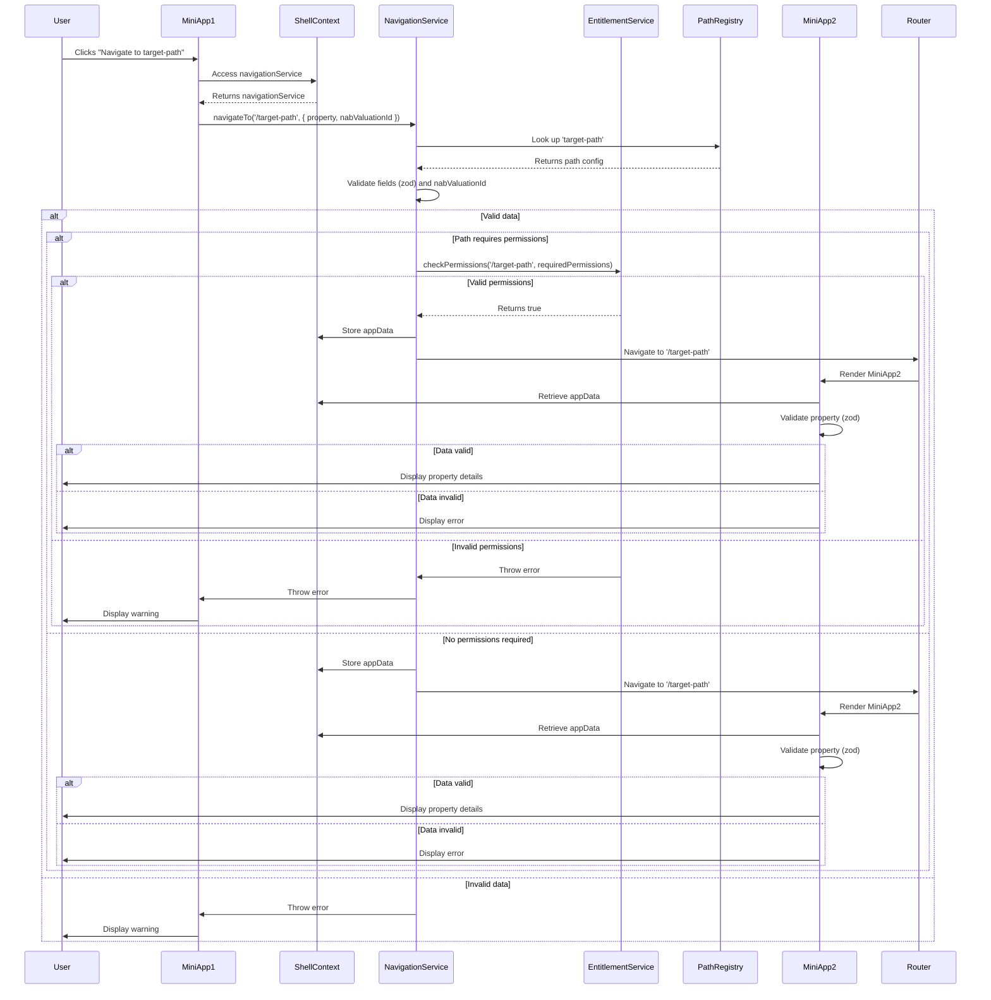

### Solution Summary

**Objective**: Enhance navigation in a microfrontend application by centralizing logic in `NavigationService`, adding `EntitlementService` for path-based permission checks, and ensuring type safety with `zod`.

#### Key Components
1. **NavigationService**:
   - **Purpose**: Manages navigation logic, including path lookup, data validation, and conditional permission checks.
   - **Functionality**:
     - Looks up `pathKey` (e.g., `target-path`) in `pathRegistry` to get `path`, `requiredFields`, and `requiredPermissions`.
     - Validates `appData` (e.g., `property`, `nabValuationId`) using `zod` for `ICollateralProperty` and type checks for primitives.
     - Calls `EntitlementService.checkPermissions` only if `requiredPermissions` exist for the path.
     - Stores `appData` in `ShellContext` and navigates via `react-router-dom`.
   - **Error Handling**: Throws errors for invalid paths, data, or permissions, displayed as warnings in `MiniApp1`.

2. **EntitlementService**:
   - **Purpose**: Handles permission checks based on the path name and `requiredPermissions`.
   - **Functionality**:
     - Method: `checkPermissions(path: string, requiredPermissions: string[])` validates if the user has all required permissions for the given path.
     - Uses a mock `userPermissionsByPath` store (e.g., `{ '/target-path': ['view-collateral'] }`) for demonstration, pending your permission source details.
     - Throws detailed errors for insufficient permissions (e.g., “Required view-collateral, but found edit-collateral”).
   - **Extensibility**: Can be updated for async API calls if permissions are fetched dynamically.

3. **Shared Types and Zod Schemas**:
   - **ICollateralPropertySchema**:
     ```typescript
     z.object({
       id: z.string(),
       status: z.string(),
       valuations: z.array(z.unknown()), // Placeholder
       titles: z.array(z.unknown()), // Placeholder
     })
     ```
     - Validates `property` without manual checks; `permissions` field removed as it’s not used for checks.
   - **PathConfig**:
     ```typescript
     type PathConfig = {
       path: string;
       requiredFields: string[];
       requiredPermissions?: string[]; // Optional for public paths
     }
     ```
   - **pathRegistry**: Maps `pathKey` to `PathConfig` (e.g., `target-path` requires `view-collateral`, `public-path` skips permissions).

4. **ShellContext**:
   - Provides `navigationService` and `entitlementService` to miniapps via `useMemo` for performance.
   - Stores `appData` for access by destination miniapps.

5. **Miniapps**:
   - **MiniApp1 (Source)**: Calls `navigationService.navigateTo`, handles errors (e.g., invalid data, permissions) with user-friendly warnings.
   - **MiniApp2 (Destination)**: Retrieves `appData` from `ShellContext`, validates `property` with `zod`, and displays details or errors.

6. **Microfrontend Compatibility**:
   - Uses Module Federation to share `EntitlementService`, `NavigationService`, and `shared-types` across shell and miniapps.
   - Supports nested routes and context-specific requirements.

#### Key Features
- **Path-Based Permission Checks**: `EntitlementService.checkPermissions` is only called for paths with `requiredPermissions`, skipping public paths (e.g., `/public-path`).
- **Zod Validation**: Ensures type safety for `ICollateralProperty` without manual property checks.
- **Centralized Logic**: `NavigationService` and `EntitlementService` improve modularity and testability.
- **Error Handling**: Detailed errors for invalid paths, data, or permissions, logged and displayed in miniapps.
- **Performance**: Validation and permission checks take <10ms; conditional checks optimize for public paths.
- **Testing**: Unit tests for `EntitlementService` and `NavigationService` verify path-based permissions and validation.

#### Updated Sequence Diagram


#### Implementation Highlights
- **EntitlementService**:
  ```typescript
  class EntitlementService {
    checkPermissions(path: string, requiredPermissions: string[]): boolean {
      const userPermissions = userPermissionsByPath[path] || [];
      const hasPermissions = requiredPermissions.every((perm) => userPermissions.includes(perm));
      if (!hasPermissions) {
        throw new Error(`Insufficient permissions for path ${path}`);
      }
      return true;
    }
  }
  ```
- **NavigationService**:
  ```typescript
  class NavigationService {
    navigateTo(pathKey: string, appData: { property: ICollateralProperty; nabValuationId?: string }) {
      const config = pathRegistry[pathKey];
      if (!config) throw new Error(`Invalid pathKey: ${pathKey}`);
      // Validate fields and property
      if (config.requiredPermissions?.length) {
        this.entitlementService.checkPermissions(config.path, config.requiredPermissions);
      }
      this.setAppData(appData);
      this.navigate(config.path);
    }
  }
  ```

#### Pending Clarifications
1. **Permission Source**: The solution uses a mock `userPermissionsByPath`. Please specify how permissions are determined (e.g., user session, API). If API-based, provide endpoint details.
2. **Array Types**: `valuations` and `titles` are placeholders (`z.unknown()`). Share their structures for a refined `zod` schema.
3. **Additional Paths**: Provide a sample `pathRegistry` or specific paths to include.
4. **Async Needs**: Should `checkPermissions` be async (e.g., for API calls)?

#### Next Steps
- Replace mock `userPermissionsByPath` with your permission source.
- Update `zod` schemas with `valuations` and `titles` details.
- Optionally add logging, analytics, or a monorepo setup.
