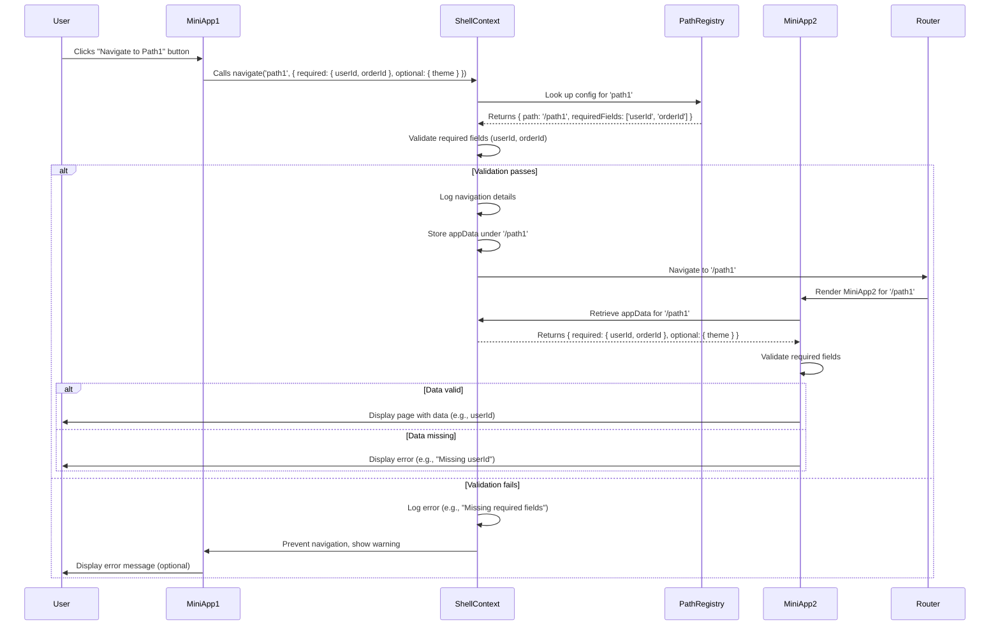

To address your request for a visualization diagram, I’ll create a **UML-like diagram** using **Mermaid syntax** to represent the navigation and data-passing flow in your React microfrontend application. The diagram will illustrate the relationships between the **Shell**, **Miniapps**, **pathRegistry**, **ShellContext**, and the navigation process, including how `appData` is passed and validated. Since you didn’t specify a particular type of diagram, I’ll assume a **sequence diagram** is suitable to show the interaction flow during navigation, as it aligns with your focus on navigation and data passing. If you prefer a different type (e.g., class diagram, flowchart), please let me know!

Mermaid is a text-based diagramming tool supported by many platforms, and I’ll provide the diagram as a code block that you can visualize in a Mermaid-compatible environment (e.g., Mermaid Live Editor, VSCode with Mermaid plugins, or GitHub READMEs). The diagram will reflect the solution proposed in the user story, including the `pathRegistry`, `navigate` function, and `appData` handling.

---

### Mermaid Sequence Diagram: Navigation and Data Passing in Microfrontend Application

Below is the Mermaid code for a sequence diagram that visualizes the navigation process from one miniapp to another, including validation and data passing via the shell’s context.



---

### Explanation of the Diagram
- **Participants**:
  - **User**: The end-user interacting with the application.
  - **MiniApp1**: The source miniapp where navigation is initiated.
  - **ShellContext**: The shell’s context managing `appData` and the `navigate` function.
  - **PathRegistry**: The centralized registry defining paths and their `appData` requirements.
  - **MiniApp2**: The destination miniapp (e.g., for `/path1`).
  - **Router**: The `react-router-dom` router handling navigation.

- **Flow**:
  1. The user clicks a button in `MiniApp1` to navigate to `path1`.
  2. `MiniApp1` calls the `navigate` function in `ShellContext` with `pathKey` (`path1`) and `appData`.
  3. `ShellContext` queries `PathRegistry` to get the configuration for `path1` (e.g., required fields: `userId`, `orderId`).
  4. `ShellContext` validates the provided `appData` against the required fields.
  5. If validation passes:
     - `ShellContext` logs the navigation details, stores `appData`, and triggers navigation via the `Router`.
     - `Router` renders `MiniApp2` for `/path1`.
     - `MiniApp2` retrieves `appData` from `ShellContext` and validates it.
     - If valid, `MiniApp2` displays the page; otherwise, it shows an error.
  6. If validation fails:
     - `ShellContext` logs an error and prevents navigation.
     - `MiniApp1` may display a warning to the user.

- **Key Features Visualized**:
  - Use of `pathRegistry` for path and data requirements.
  - Validation at both navigation and rendering stages.
  - Error handling and logging for debugging.
  - Data storage in `ShellContext` for access by destination pages.

---

### How to Visualize the Diagram
1. **Mermaid Live Editor**:
   - Copy the Mermaid code above into [Mermaid Live Editor](https://mermaid.live/).
   - It will render the sequence diagram interactively.

2. **VSCode**:
   - If you use VSCode with the Mermaid plugin (e.g., “Mermaid Preview”), paste the code into a `.md` file or a file with a `.mermaid` extension to see the diagram.

3. **GitHub**:
   - If your project uses GitHub, add the Mermaid code to a README or documentation file. GitHub supports Mermaid rendering natively.

---

### Alternative Diagram Types
If you prefer a different type of diagram, I can provide alternatives:
- **Class Diagram**: To show the relationships between `ShellContext`, `pathRegistry`, and miniapps (e.g., classes and interfaces).
  Example structure:
  ```mermaid
  classDiagram
      class ShellContext {
          -appData: Record<string, AppData>
          +navigate(pathKey: string, data: AppData)
          +setAppData(path: string, data: AppData)
      }
      class PathRegistry {
          -paths: Record<string, PathConfig>
      }
      class MiniApp {
          +useShell(): ShellContextType
      }
      ShellContext --> PathRegistry : uses
      MiniApp --> ShellContext : uses
  ```
- **Flowchart**: To show the decision-making process during navigation (e.g., validation steps).
- **Component Diagram**: To illustrate the microfrontend architecture (shell and miniapps).

---

### Next Steps
- **Confirm Visualization**: Let me know if the sequence diagram meets your needs or if you’d prefer a different type (e.g., class diagram, flowchart).
- **Provide More Details**: If you have specific components or flows (e.g., a sample `webPath` object or existing `navigate` function), I can tailor the diagram further.
- **Implementation Support**: I can provide code to implement the solution depicted in the diagram or a script to refactor your `webPath` into `pathRegistry`.
- **Search for Examples**: If you want, I can search for similar microfrontend navigation patterns on the web or X to include real-world examples.

Please let me know how you’d like to proceed or if you want to adjust the diagram!